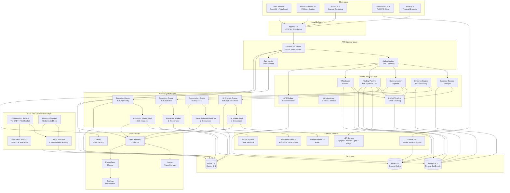
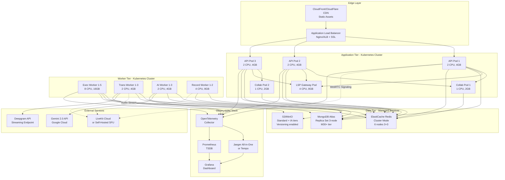
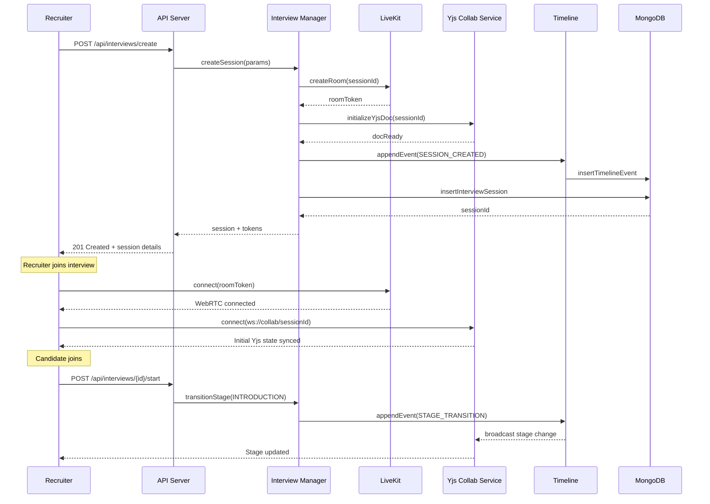
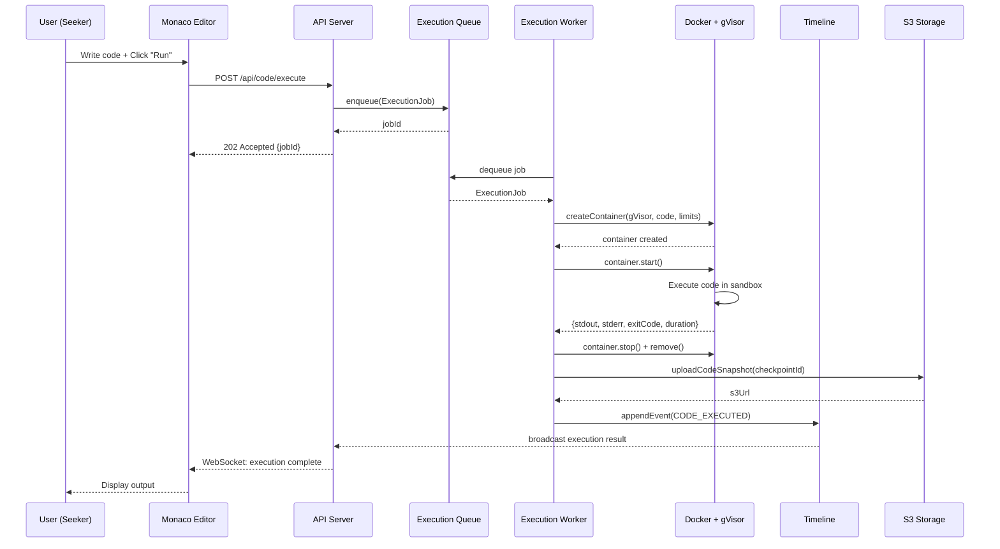
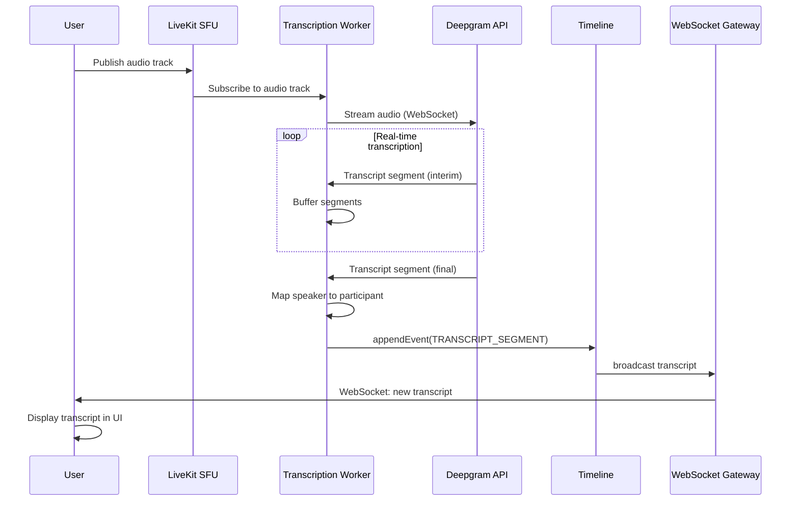
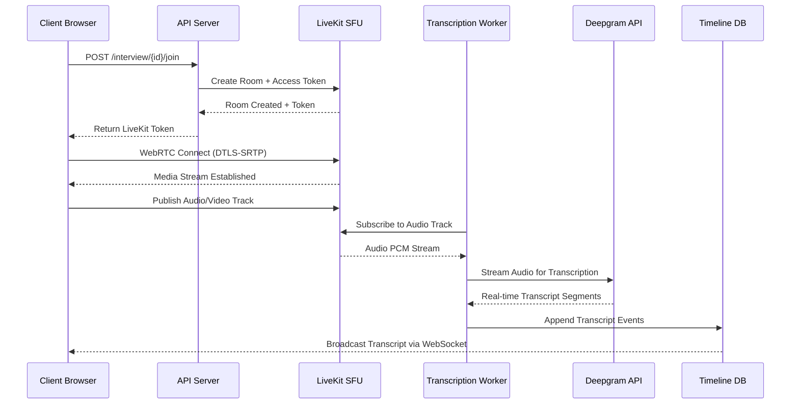
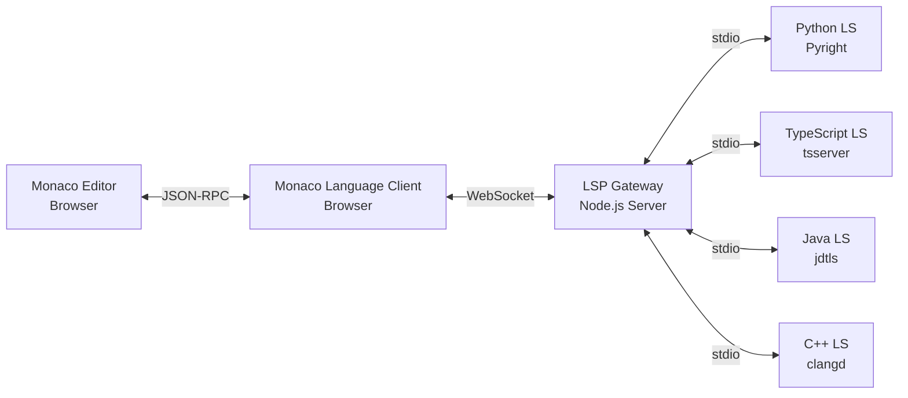
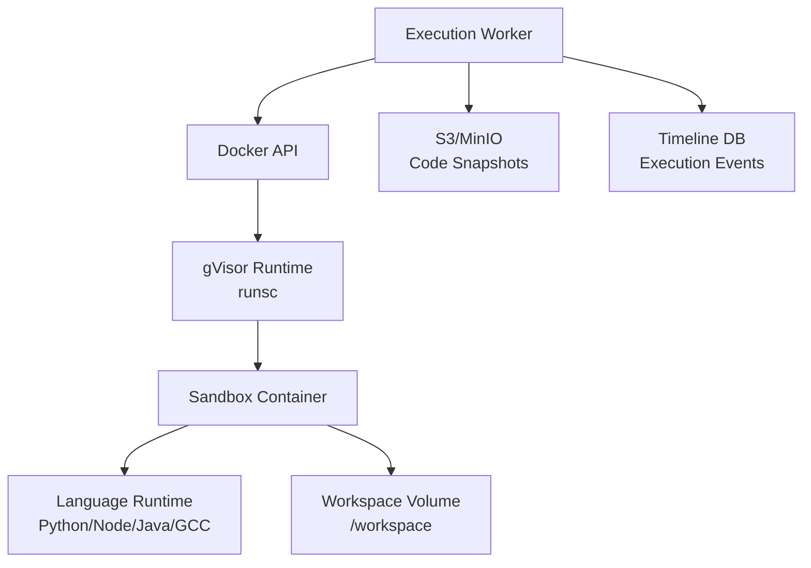

# Design Document: Real-Time Technical Interview Platform

## Overview

### Executive Summary

The Real-Time Technical Interview Platform transforms the existing Jobly recruitment system into a comprehensive technical interview environment that unifies three critical pipelines—Communication, Coding, and Whiteboard—into a single synchronized experience. The platform enables complete technical interviews with video communication, collaborative code editing with execution, and visual design collaboration, while capturing every interaction in a unified timeline for evidence-based evaluation and replay.

This design document specifies a production-ready architecture capable of handling hundreds of concurrent interview sessions with sub-100ms collaboration latency, secure code execution sandboxing, AI-powered interview assistance, and comprehensive observability for debugging and compliance.

### Design Philosophy

This platform follows a **modular monolith architecture** that avoids microservice complexity while maintaining clear domain boundaries and independent scalability. The design prioritizes:

1. **Real-time synchronization** across all collaboration surfaces (< 100ms latency)
2. **Strong isolation** for code execution (gVisor runtime for syscall-level protection)
3. **Evidence-based evaluation** linking every assessment to timestamped timeline artifacts
4. **Multi-tenant security** with strict data partitioning and row-level security
5. **Independent component scaling** via worker queues and horizontal replication
6. **Production observability** with OpenTelemetry distributed tracing
7. **Event sourcing** for complete audit trails and time-travel replay
8. **CRDT-based collaboration** for conflict-free real-time editing

### Technology Stack

**Backend Runtime:**
- Node.js 20 LTS with TypeScript 5.3+
- Express.js 4.19 for REST API
- ws 8.x (WebSocket library) for real-time bidirectional communication
- BullMQ 5.x for Redis-backed job queues with retry and rate limiting
- Helmet.js for HTTP security headers
- express-rate-limit for API rate limiting

**Data Layer:**
- MongoDB 7+ (primary database, event sourcing, document store)
- Redis 7.2+ (queues, pub/sub, caching, presence, rate limiting)
- MinIO/S3 (object storage for recordings, code snapshots, whiteboard images)

**Real-Time Collaboration:**
- Yjs 13.6+ (CRDT for collaborative editing)
- y-websocket provider with custom awareness protocol
- Redis pub/sub for cross-instance message routing
- y-mongodb-provider for persistence

**Communication Infrastructure:**
- LiveKit 1.5+ (WebRTC SFU for audio/video)
- LiveKit Egress for recording to S3
- Deepgram Nova 2 or AssemblyAI (real-time transcription with speaker diarization)
- WebRTC STUN/TURN servers (Coturn for self-hosted)

**Code Execution & Development:**
- Monaco Editor 0.45+ (VS Code editor engine)
- Language Server Protocol via monaco-languageclient 7.x
- xterm.js 5.x with node-pty 1.x for terminal emulation
- Docker 24+ with gVisor runsc runtime (or Firecracker for stronger isolation)
- LSP servers: Pyright (Python), typescript-language-server, jdtls (Java), clangd (C++)

**Whiteboard:**
- Fabric.js 6+ (canvas rendering engine with object model)
- Yjs document for collaborative state synchronization
- html2canvas for snapshot generation

**AI Integration:**
- Google Gemini 2.0 Flash or GPT-4 Turbo for interview assistance
- LangChain for prompt management and context orchestration
- Tiktoken for token counting and context window management

**Observability & Monitoring:**
- OpenTelemetry SDK Node 1.x with OTLP exporter
- Pino 8.x logger with structured JSON logging
- Prometheus metrics via prom-client
- Jaeger or Grafana Tempo for distributed trace visualization
- Grafana for dashboards
- Sentry for error tracking

**Frontend Stack:**
- React 18.2+ with TypeScript 5.x
- TanStack Query v5 (React Query) for server state management
- Zustand for client state
- Tailwind CSS 3.4+ with custom design system
- Monaco React wrapper
- LiveKit React SDK
- Fabric.js React integration
- xterm-for-react

## Architecture

### System Architecture Overview

The platform follows a **modular monolith** pattern with clearly bounded domains that communicate through well-defined interfaces. While deployed as a single application, each module can scale independently through worker processes and horizontal replication. The architecture supports horizontal scaling to handle 1000+ concurrent interviews with proper resource provisioning.



### Component Responsibilities

| Component | Responsibility | Scaling Strategy | Resource Requirements |
|-----------|---------------|------------------|----------------------|
| **API Server** | REST endpoints, WebSocket upgrades, authentication, authorization | Horizontal with load balancer + sticky sessions | 2-4 CPU, 4-8GB RAM per instance |
| **Collaboration Service** | Yjs CRDT sync, awareness protocol, state broadcasting, conflict resolution | Horizontal with Redis pub/sub for cross-instance sync | 1-2 CPU, 2-4GB RAM per instance |
| **Interview Session Manager** | Session lifecycle, stage transitions, participant management, access control | Stateless, horizontally scalable | 1 CPU, 2GB RAM per instance |
| **Communication Pipeline** | WebRTC signaling, LiveKit integration, recording management, transcript aggregation | Stateless, LiveKit handles media routing | 1 CPU, 2GB RAM per instance |
| **Coding Pipeline** | File system management, LSP coordination, snapshot creation, version control | Stateless, state in Yjs + MongoDB | 2 CPU, 4GB RAM per instance |
| **Whiteboard Pipeline** | Canvas state management, object operations, versioning, snapshot rendering | Stateless, state in Yjs + MongoDB | 1 CPU, 2GB RAM per instance |
| **Unified Timeline** | Event aggregation, correlation, search, navigation, replay | Write-heavy, event sourcing pattern with MongoDB | 1 CPU, 2GB RAM per instance |
| **Evidence Engine** | Artifact linking, evaluation validation, reference resolution, scorecard generation | Read-heavy, cached queries with Redis | 1 CPU, 2GB RAM per instance |
| **Execution Worker** | Code sandbox orchestration, resource limits enforcement, result capture, cleanup | Horizontal worker pool with dedicated machines | 4-8 CPU, 8-16GB RAM, 50GB disk per instance |
| **Transcription Worker** | Audio streaming from LiveKit, Deepgram API integration, speaker diarization mapping | Horizontal worker pool with rate limiting | 2 CPU, 4GB RAM per instance |
| **AI Worker** | Context aggregation, Gemini API calls, insight generation, evidence linking | Horizontal worker pool with rate limiting + caching | 2 CPU, 4GB RAM per instance |
| **Recording Worker** | LiveKit egress management, S3 upload, thumbnail generation, metadata extraction | Vertical scaling for video processing | 4 CPU, 8GB RAM, 100GB disk per instance |
| **LSP Gateway** | Language server process management, JSON-RPC routing, workspace management | Horizontal with process pooling | 2-4 CPU, 4-8GB RAM per instance |

### Deployment Architecture



### Data Flow Diagrams

#### Interview Session Lifecycle



#### Code Execution Flow



#### Real-Time Transcription Flow




### Key Architecture Decisions

#### ADR-001: Modular Monolith over Microservices

**Context:** Need independent scalability without operational complexity of distributed systems.

**Decision:** Build as modular monolith with domain-driven modules, shared database, and queue-based async processing.

**Rationale:**
- Simpler deployment and debugging (single process, unified logging)
- Avoid distributed transaction complexity
- Maintain ability to extract modules later if needed
- Reduce network latency for inter-module calls
- Team can iterate faster without managing service mesh

**Consequences:**
- (+) Faster development velocity
- (+) Easier debugging and tracing
- (+) Lower operational overhead
- (-) Must enforce module boundaries through code review
- (-) Entire app redeploys for any change (mitigated by feature flags)

#### ADR-002: LiveKit SFU for WebRTC Media

**Context:** Need scalable, low-latency audio/video with recording.

**Decision:** Use LiveKit SFU instead of building custom WebRTC infrastructure or using peer-to-peer mesh.

**Rationale:**
- SFU architecture scales better than peer-to-peer for multi-party calls
- LiveKit handles complex WebRTC signaling, ICE, TURN, STUN
- Built-in recording with egress to S3
- Simulcast and adaptive bitrate out of the box
- Mature open-source project with active maintenance
- Can self-host or use LiveKit Cloud

**Consequences:**
- (+) Production-ready WebRTC without building from scratch
- (+) Automatic quality adaptation for varying network conditions
- (+) Built-in recording without custom media pipeline
- (-) External dependency (mitigated by self-hosting option)
- (-) LiveKit-specific SDK lock-in (mitigated by standard WebRTC underneath)

#### ADR-003: Yjs CRDT for Collaborative Editing

**Context:** Need conflict-free real-time collaboration for code editor and whiteboard.

**Decision:** Use Yjs CRDT with Y-WebSocket provider and Redis pub/sub for multi-instance sync.

**Rationale:**
- CRDTs provide automatic conflict resolution without operational transforms
- Yjs is mature, performant, and widely used (Google Docs-like quality)
- Y-WebSocket provider handles network reconnection and late-join
- Redis pub/sub enables horizontal scaling across API server instances
- Awareness protocol provides presence and cursor positions

**Consequences:**
- (+) Conflict-free merges without custom resolution logic
- (+) Handles network partitions gracefully
- (+) Supports offline editing with eventual consistency
- (-) CRDT state overhead (mitigated by Yjs's efficient encoding)
- (-) Learning curve for team unfamiliar with CRDTs

#### ADR-004: gVisor Runtime for Code Execution Sandboxing

**Context:** Need secure isolation for untrusted candidate code execution.

**Decision:** Use Docker with gVisor runtime (runsc) for sandbox containers.

**Rationale:**
- gVisor provides userspace kernel that intercepts syscalls
- Stronger isolation than standard Docker (shared kernel)
- Lighter than full VMs (Firecracker)
- Compatible with existing Docker infrastructure
- Supports all required languages (C++, Java, Python, JS, TS)

**Consequences:**
- (+) Significant security improvement over standard containers
- (+) Reasonable performance overhead (~10-15% vs native)
- (+) Works with existing Docker tooling
- (-) Slightly higher cold-start latency than standard containers (~200-300ms)
- (-) Requires gVisor installation and configuration

#### ADR-005: Event Sourcing for Unified Timeline

**Context:** Need complete audit trail of all interview events for replay and evidence linking.

**Decision:** Use event sourcing pattern with MongoDB as durable event store and Redis Streams for real-time propagation.

**Rationale:**
- Event sourcing provides immutable audit log
- Can rebuild any state by replaying events
- Enables time-travel replay functionality
- Redis Streams allow real-time event subscription
- MongoDB provides queryable persistence

**Consequences:**
- (+) Complete audit trail for compliance and debugging
- (+) Enables powerful replay and time-travel features
- (+) Event log is source of truth
- (-) Increased storage requirements (mitigated by event archival policy)
- (-) Must design events carefully (append-only)


## Components and Interfaces

### 1. Communication Pipeline Architecture

The Communication Pipeline manages real-time audio/video communication, screen sharing, and transcription using LiveKit as the WebRTC SFU.

#### LiveKit SFU Integration

**Architecture Pattern:**
- Client establishes WebRTC connection directly to LiveKit SFU
- Application server handles room creation and token generation
- Media streams never flow through Node.js application
- Transcription worker subscribes to audio tracks



**LiveKit Room Configuration:**

```typescript
interface LiveKitRoomConfig {
  name: string;                    // Interview session ID
  emptyTimeout: number;            // Auto-close after 10 minutes empty
  maxParticipants: number;         // Typically 2-5 (candidate + interviewers)
  metadata: {
    tenantId: string;
    interviewSessionId: string;
    jobApplicationId: string;
  };
  egress: {
    roomComposite: {
      layout: 'grid' | 'speaker';
      audioOnly: false;
      videoOnly: false;
      customBaseUrl: string;       // S3 upload destination
    };
  };
}
```

**Media Routing:**
- Each participant publishes one audio track, one video track
- LiveKit SFU forwards tracks to all subscribers without transcoding
- Simulcast enabled: client sends 3 resolutions (360p, 720p, 1080p)
- SFU selects appropriate layer based on subscriber bandwidth


#### Real-Time Transcription Architecture

**Transcription Worker Design:**

```typescript
class TranscriptionWorker {
  private liveKitClient: LiveKit.RoomServiceClient;
  private deepgramClient: Deepgram.LiveTranscription;
  private audioSubscriptions: Map<string, AudioSubscription>;

  async processTranscriptionJob(job: TranscriptionJob) {
    const { interviewSessionId, roomName } = job.data;

    // Subscribe to audio tracks from LiveKit
    const room = await this.liveKitClient.getRoom(roomName);
    
    for (const participant of room.participants) {
      const audioTrack = participant.tracks.find(t => t.type === 'audio');
      
      if (audioTrack) {
        const stream = await this.subscribeToAudioTrack(audioTrack);
        
        // Stream to Deepgram for real-time transcription
        const transcriptStream = this.deepgramClient.transcribe({
          model: 'nova-2',
          language: 'en',
          diarize: true,              // Speaker identification
          punctuate: true,
          interim_results: true,
          utterance_end_ms: 1000,
        });

        stream.pipe(transcriptStream);

        transcriptStream.on('transcript', async (result) => {
          await this.handleTranscriptSegment({
            interviewSessionId,
            participantId: participant.identity,
            text: result.channel.alternatives[0].transcript,
            words: result.channel.alternatives[0].words,
            speaker: result.channel.alternatives[0].speaker,
            startTime: result.start,
            endTime: result.end,
            confidence: result.channel.alternatives[0].confidence,
            isFinal: result.is_final,
          });
        });
      }
    }
  }

  private async handleTranscriptSegment(segment: TranscriptSegment) {
    // Append to unified timeline as communication event
    await this.timelineService.appendEvent({
      type: 'TRANSCRIPT_SEGMENT',
      interviewSessionId: segment.interviewSessionId,
      timestamp: segment.startTime,
      metadata: {
        participantId: segment.participantId,
        speaker: segment.speaker,
        text: segment.text,
        confidence: segment.confidence,
        isFinal: segment.isFinal,
        words: segment.words.map(w => ({
          word: w.word,
          start: w.start,
          end: w.end,
          confidence: w.confidence,
          speaker: w.speaker,
        })),
      },
    });

    // Broadcast to connected clients via WebSocket
    this.wsGateway.broadcast(`interview:${segment.interviewSessionId}`, {
      type: 'transcript',
      data: segment,
    });
  }
}
```

**Speaker Diarization Strategy:**
- Deepgram/AssemblyAI assigns speaker labels (SPEAKER_0, SPEAKER_1)
- Application maps speaker labels to participant identities using audio track metadata
- Confidence scores help identify overlapping speech or unclear segments

**Transcript Storage Schema:**

```typescript
interface TranscriptDocument {
  _id: ObjectId;
  interviewSessionId: ObjectId;
  segments: Array<{
    startTime: Date;
    endTime: Date;
    participantId: ObjectId;
    speaker: string;              // SPEAKER_0, SPEAKER_1, etc.
    text: string;
    words: Array<{
      word: string;
      start: number;              // Milliseconds from segment start
      end: number;
      confidence: number;
      speaker: string;
    }>;
    confidence: number;
    isFinal: boolean;
  }>;
  createdAt: Date;
  updatedAt: Date;
}
```


### 2. Coding Pipeline Architecture

The Coding Pipeline provides a full collaborative IDE experience with Monaco editor, LSP integration, terminal access, and secure code execution.

#### Collaborative Code Editor with Yjs

**Yjs Document Structure:**

```typescript
// Yjs document organization for coding pipeline
interface CodingYjsDocument {
  files: Y.Map<FileContent>;          // Map<filePath, Y.Text>
  filesystem: Y.Map<FileSystemNode>;  // Map<path, metadata>
  activeFiles: Y.Map<string>;         // Map<participantId, activeFilePath>
  awareness: Awareness;               // Cursor positions, selections, presence
}

interface FileContent extends Y.Text {
  // Y.Text provides CRDT text editing
  // Operations: insert, delete, format
}

interface FileSystemNode {
  type: 'file' | 'directory';
  path: string;
  name: string;
  parentPath: string | null;
  children: string[];              // Array of child paths (for directories)
  metadata: {
    createdAt: Date;
    updatedAt: Date;
    createdBy: string;             // Participant ID
    size?: number;                 // File size in bytes
    language?: string;             // For syntax highlighting
  };
}
```

**Yjs WebSocket Provider with Redis Pub/Sub:**

```typescript
class YjsCollaborationService {
  private yjsDocuments: Map<string, Y.Doc>;
  private wsConnections: Map<string, Set<WebSocket>>;
  private redisPubSub: Redis;

  async handleYjsConnection(ws: WebSocket, interviewSessionId: string) {
    const doc = this.getOrCreateYjsDoc(interviewSessionId);
    
    // Subscribe to Redis pub/sub for cross-instance sync
    await this.subscribeToRedisChannel(interviewSessionId);

    // Sync initial state to client
    const stateVector = Y.encodeStateVector(doc);
    ws.send(Y.encodeStateAsUpdate(doc, stateVector));

    // Handle incoming Yjs updates from client
    ws.on('message', async (data: Buffer) => {
      const message = decodeYjsMessage(data);
      
      if (message.type === 'update') {
        // Apply update to local doc
        Y.applyUpdate(doc, message.update);
        
        // Broadcast to other clients on this instance
        this.broadcastToLocalClients(interviewSessionId, data, ws);
        
        // Publish to Redis for other instances
        await this.redisPubSub.publish(
          `yjs:${interviewSessionId}`,
          message.update
        );

        // Persist to MongoDB (debounced)
        await this.persistYjsUpdate(interviewSessionId, message.update);
      }
    });

    // Handle awareness updates (cursors, selections)
    doc.awareness.on('update', (changes) => {
      const awarenessUpdate = encodeAwarenessUpdate(doc.awareness, changes);
      this.broadcastToLocalClients(interviewSessionId, awarenessUpdate, ws);
      await this.redisPubSub.publish(
        `yjs:awareness:${interviewSessionId}`,
        awarenessUpdate
      );
    });
  }

  private async subscribeToRedisChannel(interviewSessionId: string) {
    // Subscribe to Yjs updates from other instances
    await this.redisPubSub.subscribe(
      `yjs:${interviewSessionId}`,
      (update: Buffer) => {
        const doc = this.getOrCreateYjsDoc(interviewSessionId);
        Y.applyUpdate(doc, update);
        this.broadcastToLocalClients(interviewSessionId, update);
      }
    );

    // Subscribe to awareness updates
    await this.redisPubSub.subscribe(
      `yjs:awareness:${interviewSessionId}`,
      (awarenessUpdate: Buffer) => {
        const doc = this.getOrCreateYjsDoc(interviewSessionId);
        applyAwarenessUpdate(doc.awareness, awarenessUpdate);
        this.broadcastToLocalClients(interviewSessionId, awarenessUpdate);
      }
    );
  }
}
```


#### Monaco Editor with LSP Integration

**LSP Architecture:**



**LSP Gateway Implementation:**

```typescript
class LSPGateway {
  private languageServers: Map<string, LanguageServerConnection>;

  constructor() {
    this.languageServers = new Map([
      ['python', this.createPythonLS()],
      ['typescript', this.createTypeScriptLS()],
      ['javascript', this.createTypeScriptLS()],
      ['java', this.createJavaLS()],
      ['cpp', this.createCppLS()],
    ]);
  }

  private createPythonLS(): LanguageServerConnection {
    const serverProcess = spawn('pyright-langserver', ['--stdio']);
    return new LanguageServerConnection(serverProcess);
  }

  private createTypeScriptLS(): LanguageServerConnection {
    const serverProcess = spawn('typescript-language-server', ['--stdio']);
    return new LanguageServerConnection(serverProcess);
  }

  private createJavaLS(): LanguageServerConnection {
    const serverProcess = spawn('jdtls', ['-data', '/workspace']);
    return new LanguageServerConnection(serverProcess);
  }

  private createCppLS(): LanguageServerConnection {
    const serverProcess = spawn('clangd', ['--background-index']);
    return new LanguageServerConnection(serverProcess);
  }

  async handleLSPRequest(
    language: string,
    method: string,
    params: any,
    interviewSessionId: string
  ) {
    const ls = this.languageServers.get(language);
    if (!ls) {
      throw new Error(`Language server not found for: ${language}`);
    }

    // Forward LSP request to appropriate language server
    const result = await ls.sendRequest(method, params);
    return result;
  }
}
```

**LSP Features Supported:**

| Feature | Method | Description |
|---------|--------|-------------|
| **Autocomplete** | `textDocument/completion` | Context-aware suggestions |
| **Diagnostics** | `textDocument/publishDiagnostics` | Errors, warnings, hints |
| **Hover Info** | `textDocument/hover` | Symbol documentation |
| **Go to Definition** | `textDocument/definition` | Navigate to symbol definition |
| **Find References** | `textDocument/references` | Find all usages |
| **Format Document** | `textDocument/formatting` | Auto-format code |
| **Signature Help** | `textDocument/signatureHelp` | Function parameter hints |


#### Terminal with PTY

**xterm.js + node-pty Architecture:**

```typescript
class TerminalService {
  private terminals: Map<string, IPty>;
  private terminalSessions: Map<string, TerminalSession>;

  createTerminal(interviewSessionId: string, participantId: string): TerminalSession {
    // Create PTY process
    const pty = spawn('bash', [], {
      name: 'xterm-256color',
      cols: 80,
      rows: 30,
      cwd: `/workspace/${interviewSessionId}`,
      env: {
        ...process.env,
        TERM: 'xterm-256color',
        COLORTERM: 'truecolor',
        INTERVIEW_SESSION_ID: interviewSessionId,
        WORKSPACE: `/workspace/${interviewSessionId}`,
      },
    });

    const sessionId = `${interviewSessionId}:${participantId}`;
    
    // Broadcast terminal output to all participants
    pty.onData((data: string) => {
      this.wsGateway.broadcast(`interview:${interviewSessionId}`, {
        type: 'terminal:output',
        sessionId,
        data,
      });

      // Append to timeline
      this.timelineService.appendEvent({
        type: 'TERMINAL_OUTPUT',
        interviewSessionId,
        timestamp: new Date(),
        metadata: {
          sessionId,
          output: data,
          participantId,
        },
      });
    });

    // Handle terminal exit
    pty.onExit(({ exitCode, signal }) => {
      console.log(`Terminal exited: code=${exitCode}, signal=${signal}`);
      this.terminals.delete(sessionId);
    });

    this.terminals.set(sessionId, pty);

    return {
      sessionId,
      cols: 80,
      rows: 30,
    };
  }

  writeToTerminal(sessionId: string, data: string) {
    const pty = this.terminals.get(sessionId);
    if (!pty) {
      throw new Error(`Terminal session not found: ${sessionId}`);
    }

    pty.write(data);

    // Record command in timeline
    this.timelineService.appendEvent({
      type: 'TERMINAL_INPUT',
      interviewSessionId: sessionId.split(':')[0],
      timestamp: new Date(),
      metadata: {
        sessionId,
        input: data,
      },
    });
  }

  resizeTerminal(sessionId: string, cols: number, rows: number) {
    const pty = this.terminals.get(sessionId);
    if (pty) {
      pty.resize(cols, rows);
    }
  }
}
```

**Terminal Security:**
- Each terminal runs in the interview session's workspace directory
- Restricted network access (no outbound except package registries)
- Resource limits enforced by cgroup (CPU, memory, disk)
- Commands recorded in audit log


#### Secure Code Execution Sandbox

**Docker + gVisor Architecture:**



**Sandbox Configuration:**

```typescript
interface SandboxConfig {
  interviewSessionId: string;
  language: 'python' | 'javascript' | 'typescript' | 'java' | 'cpp';
  code: string;
  input?: string;
  timeoutMs: number;          // Default: 30000 (30 seconds)
  memoryLimitMb: number;      // Default: 512 MB
  cpuQuota: number;           // Default: 1.0 (1 CPU)
}

class ExecutionWorker {
  async processExecutionJob(job: ExecutionJob) {
    const { config } = job.data;
    
    const containerConfig = this.buildContainerConfig(config);
    
    try {
      // Create container with gVisor runtime
      const container = await this.dockerClient.createContainer({
        Image: this.getImageForLanguage(config.language),
        Cmd: this.getExecutionCommand(config),
        HostConfig: {
          Runtime: 'runsc',              // gVisor runtime
          Memory: config.memoryLimitMb * 1024 * 1024,
          MemorySwap: 0,                 // Disable swap
          CpuQuota: config.cpuQuota * 100000,
          CpuPeriod: 100000,
          NetworkMode: 'none',           // No network access
          ReadonlyRootfs: true,          // Read-only filesystem
          SecurityOpt: ['no-new-privileges'],
          CapDrop: ['ALL'],              // Drop all capabilities
          Tmpfs: {
            '/tmp': 'rw,noexec,nosuid,size=100m',
            '/workspace': 'rw,noexec,nosuid,size=500m',
          },
        },
        WorkingDir: '/workspace',
        Env: [
          `LANGUAGE=${config.language}`,
          `TIMEOUT_MS=${config.timeoutMs}`,
        ],
      });

      // Write code to container filesystem
      await container.start();
      await this.writeCodeToContainer(container, config.code);

      // Execute with timeout
      const result = await this.executeWithTimeout(
        container,
        config.timeoutMs
      );

      // Capture output
      const logs = await container.logs({
        stdout: true,
        stderr: true,
        timestamps: true,
      });

      // Clean up
      await container.stop();
      await container.remove();

      return {
        stdout: logs.stdout,
        stderr: logs.stderr,
        exitCode: result.exitCode,
        duration: result.duration,
        memoryUsed: result.memoryUsed,
        cpuUsed: result.cpuUsed,
      };

    } catch (error) {
      if (error.code === 'TIMEOUT') {
        return {
          stdout: '',
          stderr: 'Execution timed out',
          exitCode: 124,
          duration: config.timeoutMs,
          timeout: true,
        };
      }
      throw error;
    }
  }

  private getImageForLanguage(language: string): string {
    const images = {
      python: 'python:3.11-slim',
      javascript: 'node:20-alpine',
      typescript: 'node:20-alpine',
      java: 'openjdk:21-slim',
      cpp: 'gcc:13-bookworm',
    };
    return images[language];
  }

  private getExecutionCommand(config: SandboxConfig): string[] {
    const commands = {
      python: ['python', '/workspace/main.py'],
      javascript: ['node', '/workspace/main.js'],
      typescript: ['tsx', '/workspace/main.ts'],
      java: ['java', '-cp', '/workspace', 'Main'],
      cpp: ['sh', '-c', 'g++ /workspace/main.cpp -o /tmp/a.out && /tmp/a.out'],
    };
    return commands[config.language];
  }
}
```

**Resource Limits Enforcement:**

| Resource | Limit | Enforcement |
|----------|-------|-------------|
| **CPU** | 1.0 CPU core | Docker CpuQuota + cgroup |
| **Memory** | 512 MB | Docker Memory limit |
| **Disk** | 500 MB tmpfs | Tmpfs mount with size limit |
| **Network** | No network | NetworkMode: 'none' |
| **Execution Time** | 30 seconds | Application-level timeout + kill |
| **Syscalls** | Restricted | gVisor userspace kernel intercept |


#### Code History and Checkpoints

**Checkpoint Strategy:**

```typescript
interface CodeCheckpoint {
  _id: ObjectId;
  interviewSessionId: ObjectId;
  checkpointNumber: number;
  timestamp: Date;
  trigger: 'EXECUTION' | 'STAGE_TRANSITION' | 'MANUAL' | 'AUTO_SAVE';
  createdBy: ObjectId;             // Participant ID
  
  // Complete workspace snapshot
  filesystem: {
    files: Array<{
      path: string;
      content: string;
      language: string;
      size: number;
    }>;
    directories: Array<{
      path: string;
    }>;
  };
  
  // Reference to Yjs document state
  yjsStateVector: Buffer;          // Y.encodeStateVector
  yjsSnapshot: Buffer;             // Y.encodeStateAsUpdate
  
  // S3 reference for large snapshots
  s3Key?: string;
  
  metadata: {
    totalFiles: number;
    totalSize: number;
    description?: string;
  };
}

class CheckpointService {
  async createCheckpoint(
    interviewSessionId: string,
    trigger: string,
    createdBy: string,
    description?: string
  ): Promise<CodeCheckpoint> {
    const yjsDoc = this.yjsService.getDocument(interviewSessionId);
    
    // Capture current filesystem state
    const filesMap = yjsDoc.getMap('files');
    const fsMap = yjsDoc.getMap('filesystem');
    
    const files: Array<any> = [];
    filesMap.forEach((content: Y.Text, path: string) => {
      const node = fsMap.get(path);
      if (node && node.type === 'file') {
        files.push({
          path,
          content: content.toString(),
          language: node.metadata.language,
          size: content.length,
        });
      }
    });

    const directories: Array<any> = [];
    fsMap.forEach((node, path) => {
      if (node.type === 'directory') {
        directories.push({ path });
      }
    });

    // Encode Yjs state
    const stateVector = Y.encodeStateVector(yjsDoc);
    const snapshot = Y.encodeStateAsUpdate(yjsDoc);

    // Calculate total size
    const totalSize = files.reduce((sum, f) => sum + f.size, 0);

    // If snapshot > 10MB, upload to S3
    let s3Key: string | undefined;
    if (totalSize > 10 * 1024 * 1024) {
      s3Key = await this.uploadSnapshotToS3(interviewSessionId, {
        files,
        directories,
        yjsSnapshot: snapshot,
      });
    }

    const checkpoint: CodeCheckpoint = {
      _id: new ObjectId(),
      interviewSessionId: new ObjectId(interviewSessionId),
      checkpointNumber: await this.getNextCheckpointNumber(interviewSessionId),
      timestamp: new Date(),
      trigger,
      createdBy: new ObjectId(createdBy),
      filesystem: {
        files: s3Key ? [] : files,      // Store in DB if small
        directories,
      },
      yjsStateVector: stateVector,
      yjsSnapshot: s3Key ? Buffer.from([]) : snapshot,
      s3Key,
      metadata: {
        totalFiles: files.length,
        totalSize,
        description,
      },
    };

    await this.checkpointRepo.save(checkpoint);

    // Append to timeline
    await this.timelineService.appendEvent({
      type: 'CODE_CHECKPOINT',
      interviewSessionId,
      timestamp: new Date(),
      metadata: {
        checkpointId: checkpoint._id,
        checkpointNumber: checkpoint.checkpointNumber,
        trigger,
        totalFiles: files.length,
        totalSize,
      },
    });

    return checkpoint;
  }

  async restoreCheckpoint(checkpointId: string): Promise<void> {
    const checkpoint = await this.checkpointRepo.findById(checkpointId);
    const yjsDoc = this.yjsService.getDocument(
      checkpoint.interviewSessionId.toString()
    );

    // Load snapshot from S3 if needed
    let snapshot = checkpoint.yjsSnapshot;
    if (checkpoint.s3Key) {
      const data = await this.s3Client.getObject(checkpoint.s3Key);
      snapshot = data.yjsSnapshot;
    }

    // Apply snapshot to Yjs document
    Y.applyUpdate(yjsDoc, snapshot);

    // Broadcast to all connected clients
    this.wsGateway.broadcast(
      `interview:${checkpoint.interviewSessionId}`,
      {
        type: 'checkpoint:restored',
        checkpointId,
        checkpointNumber: checkpoint.checkpointNumber,
      }
    );
  }
}
```

**Checkpoint Triggers:**

| Trigger | Condition | Frequency |
|---------|-----------|-----------|
| **EXECUTION** | After each code execution | Per execution |
| **STAGE_TRANSITION** | When interview stage changes | Per stage change |
| **AUTO_SAVE** | Significant edits detected | Every 5 minutes |
| **MANUAL** | Recruiter creates checkpoint | On demand |


### 3. Whiteboard Pipeline Architecture

The Whiteboard Pipeline provides collaborative visual design capabilities using Fabric.js for canvas rendering and Yjs for state synchronization.

#### Fabric.js Canvas with Yjs CRDT

**Yjs Document Structure for Whiteboard:**

```typescript
interface WhiteboardYjsDocument {
  objects: Y.Map<WhiteboardObject>;     // Map<objectId, object data>
  layers: Y.Array<string>;              // Ordered array of object IDs (z-index)
  viewport: Y.Map<ViewportState>;       // Pan/zoom state per participant
  awareness: Awareness;                 // Cursor positions, selection
}

interface WhiteboardObject {
  id: string;
  type: 'rect' | 'circle' | 'ellipse' | 'triangle' | 'line' | 'arrow' | 'path' | 'text' | 'sticky-note';
  properties: {
    left: number;
    top: number;
    width?: number;
    height?: number;
    radius?: number;
    points?: number[];              // For line, arrow, path
    text?: string;                  // For text, sticky-note
    fill?: string;
    stroke?: string;
    strokeWidth?: number;
    opacity?: number;
    rotation?: number;
    scaleX?: number;
    scaleY?: number;
  };
  metadata: {
    createdAt: Date;
    createdBy: string;              // Participant ID
    updatedAt: Date;
    updatedBy: string;
    locked?: boolean;
    groupId?: string;               // For grouped objects
  };
}

interface ViewportState {
  zoom: number;
  panX: number;
  panY: number;
}
```

**Whiteboard Collaboration Service:**

```typescript
class WhiteboardCollaborationService {
  private fabricCanvases: Map<string, fabric.Canvas>;

  initializeCanvas(
    interviewSessionId: string,
    canvasElement: HTMLCanvasElement
  ) {
    const canvas = new fabric.Canvas(canvasElement, {
      width: 4000,
      height: 3000,
      backgroundColor: '#ffffff',
      selection: true,
      preserveObjectStacking: true,
    });

    const yjsDoc = this.yjsService.getDocument(interviewSessionId);
    const objectsMap = yjsDoc.getMap('objects');
    const layersArray = yjsDoc.getArray('layers');

    // Load existing objects from Yjs
    this.loadObjectsFromYjs(canvas, objectsMap, layersArray);

    // Listen to local canvas events
    canvas.on('object:added', (e) => {
      this.handleObjectAdded(interviewSessionId, e.target);
    });

    canvas.on('object:modified', (e) => {
      this.handleObjectModified(interviewSessionId, e.target);
    });

    canvas.on('object:removed', (e) => {
      this.handleObjectRemoved(interviewSessionId, e.target);
    });

    // Listen to Yjs updates from other participants
    objectsMap.observe((event) => {
      event.changes.keys.forEach((change, key) => {
        if (change.action === 'add' || change.action === 'update') {
          this.applyYjsObjectToCanvas(canvas, key, objectsMap.get(key));
        } else if (change.action === 'delete') {
          this.removeObjectFromCanvas(canvas, key);
        }
      });
    });

    this.fabricCanvases.set(interviewSessionId, canvas);
    return canvas;
  }

  private handleObjectAdded(interviewSessionId: string, object: fabric.Object) {
    const yjsDoc = this.yjsService.getDocument(interviewSessionId);
    const objectsMap = yjsDoc.getMap('objects');
    const layersArray = yjsDoc.getArray('layers');

    const objectData: WhiteboardObject = {
      id: object.id || this.generateObjectId(),
      type: this.getFabricObjectType(object),
      properties: this.serializeFabricObject(object),
      metadata: {
        createdAt: new Date(),
        createdBy: this.currentParticipantId,
        updatedAt: new Date(),
        updatedBy: this.currentParticipantId,
      },
    };

    // Add to Yjs map (triggers remote updates)
    objectsMap.set(objectData.id, objectData);
    layersArray.push([objectData.id]);

    // Append to timeline
    this.timelineService.appendEvent({
      type: 'WHITEBOARD_OBJECT_CREATED',
      interviewSessionId,
      timestamp: new Date(),
      metadata: {
        objectId: objectData.id,
        objectType: objectData.type,
        participantId: this.currentParticipantId,
      },
    });
  }

  private handleObjectModified(interviewSessionId: string, object: fabric.Object) {
    const yjsDoc = this.yjsService.getDocument(interviewSessionId);
    const objectsMap = yjsDoc.getMap('objects');

    const existingData = objectsMap.get(object.id);
    if (existingData) {
      const updatedData: WhiteboardObject = {
        ...existingData,
        properties: this.serializeFabricObject(object),
        metadata: {
          ...existingData.metadata,
          updatedAt: new Date(),
          updatedBy: this.currentParticipantId,
        },
      };

      objectsMap.set(object.id, updatedData);

      this.timelineService.appendEvent({
        type: 'WHITEBOARD_OBJECT_MODIFIED',
        interviewSessionId,
        timestamp: new Date(),
        metadata: {
          objectId: object.id,
          changes: this.diffObjects(existingData.properties, updatedData.properties),
          participantId: this.currentParticipantId,
        },
      });
    }
  }
}
```


#### Whiteboard Snapshots and Versioning

**Snapshot Strategy:**

```typescript
interface WhiteboardSnapshot {
  _id: ObjectId;
  interviewSessionId: ObjectId;
  snapshotNumber: number;
  timestamp: Date;
  trigger: 'STAGE_TRANSITION' | 'MANUAL' | 'AUTO_SAVE';
  createdBy: ObjectId;

  // Complete whiteboard state
  objects: WhiteboardObject[];
  layers: string[];                    // Z-index ordering
  viewport: {
    zoom: number;
    panX: number;
    panY: number;
  };

  // Yjs state
  yjsStateVector: Buffer;
  yjsSnapshot: Buffer;

  // PNG preview image
  previewImageUrl?: string;            // S3 URL for canvas preview

  metadata: {
    totalObjects: number;
    description?: string;
  };
}

class WhiteboardSnapshotService {
  async createSnapshot(
    interviewSessionId: string,
    trigger: string,
    createdBy: string
  ): Promise<WhiteboardSnapshot> {
    const yjsDoc = this.yjsService.getDocument(interviewSessionId);
    const objectsMap = yjsDoc.getMap('objects');
    const layersArray = yjsDoc.getArray('layers');
    const viewportMap = yjsDoc.getMap('viewport');

    // Serialize all objects
    const objects: WhiteboardObject[] = [];
    objectsMap.forEach((obj, id) => {
      objects.push(obj);
    });

    const layers = layersArray.toArray();

    // Generate canvas preview image
    const canvas = this.fabricCanvases.get(interviewSessionId);
    const previewDataUrl = canvas?.toDataURL({
      format: 'png',
      quality: 0.8,
      multiplier: 0.5,              // Half resolution for preview
    });

    // Upload preview to S3
    const previewImageUrl = await this.uploadPreviewToS3(
      interviewSessionId,
      previewDataUrl
    );

    const snapshot: WhiteboardSnapshot = {
      _id: new ObjectId(),
      interviewSessionId: new ObjectId(interviewSessionId),
      snapshotNumber: await this.getNextSnapshotNumber(interviewSessionId),
      timestamp: new Date(),
      trigger,
      createdBy: new ObjectId(createdBy),
      objects,
      layers,
      viewport: {
        zoom: viewportMap.get('zoom') || 1.0,
        panX: viewportMap.get('panX') || 0,
        panY: viewportMap.get('panY') || 0,
      },
      yjsStateVector: Y.encodeStateVector(yjsDoc),
      yjsSnapshot: Y.encodeStateAsUpdate(yjsDoc),
      previewImageUrl,
      metadata: {
        totalObjects: objects.length,
      },
    };

    await this.snapshotRepo.save(snapshot);

    // Append to timeline
    await this.timelineService.appendEvent({
      type: 'WHITEBOARD_SNAPSHOT',
      interviewSessionId,
      timestamp: new Date(),
      metadata: {
        snapshotId: snapshot._id,
        snapshotNumber: snapshot.snapshotNumber,
        trigger,
        totalObjects: objects.length,
        previewImageUrl,
      },
    });

    return snapshot;
  }

  async restoreSnapshot(snapshotId: string): Promise<void> {
    const snapshot = await this.snapshotRepo.findById(snapshotId);
    const yjsDoc = this.yjsService.getDocument(
      snapshot.interviewSessionId.toString()
    );

    // Apply Yjs snapshot
    Y.applyUpdate(yjsDoc, snapshot.yjsSnapshot);

    // Broadcast to all clients
    this.wsGateway.broadcast(
      `interview:${snapshot.interviewSessionId}`,
      {
        type: 'whiteboard:snapshot:restored',
        snapshotId,
        snapshotNumber: snapshot.snapshotNumber,
      }
    );
  }
}
```


### 4. Unified Timeline Architecture

The Unified Timeline aggregates events from all three pipelines into a single chronological stream using event sourcing pattern.

#### Event Sourcing Schema

```typescript
interface TimelineEvent {
  _id: ObjectId;
  interviewSessionId: ObjectId;
  tenantId: ObjectId;
  
  eventType: TimelineEventType;
  timestamp: Date;
  sequenceNumber: number;          // Monotonic counter per session
  
  // Polymorphic event data
  metadata: CommunicationEvent | CodingEvent | WhiteboardEvent | SessionEvent;
  
  // Event correlation
  correlationId?: string;          // Link related events
  causationId?: string;            // Event that caused this event
  
  // Participant attribution
  participantId?: ObjectId;
  participantRole: 'SEEKER' | 'RECRUITER';
  
  // Indexing
  searchableText?: string;         // For full-text search
  tags: string[];
  
  createdAt: Date;
}

type TimelineEventType =
  // Session events
  | 'SESSION_CREATED'
  | 'SESSION_STARTED'
  | 'SESSION_COMPLETED'
  | 'PARTICIPANT_JOINED'
  | 'PARTICIPANT_LEFT'
  | 'STAGE_TRANSITION'
  
  // Communication events
  | 'TRANSCRIPT_SEGMENT'
  | 'SCREEN_SHARE_STARTED'
  | 'SCREEN_SHARE_STOPPED'
  | 'RECORDING_STARTED'
  | 'RECORDING_STOPPED'
  
  // Coding events
  | 'FILE_CREATED'
  | 'FILE_DELETED'
  | 'FILE_RENAMED'
  | 'CODE_EDITED'
  | 'CODE_EXECUTED'
  | 'CODE_CHECKPOINT'
  | 'TERMINAL_COMMAND'
  | 'TERMINAL_OUTPUT'
  | 'TEST_RUN'
  
  // Whiteboard events
  | 'WHITEBOARD_OBJECT_CREATED'
  | 'WHITEBOARD_OBJECT_MODIFIED'
  | 'WHITEBOARD_OBJECT_DELETED'
  | 'WHITEBOARD_OBJECT_GROUPED'
  | 'WHITEBOARD_SNAPSHOT';

interface CommunicationEvent {
  type: 'communication';
  transcriptSegment?: {
    text: string;
    speaker: string;
    confidence: number;
    words: Array<{
      word: string;
      start: number;
      end: number;
      confidence: number;
    }>;
  };
  screenShare?: {
    action: 'started' | 'stopped';
    participantId: string;
  };
  recording?: {
    action: 'started' | 'stopped';
    recordingId: string;
  };
}

interface CodingEvent {
  type: 'coding';
  file?: {
    path: string;
    action: 'created' | 'deleted' | 'renamed';
    oldPath?: string;
    language?: string;
  };
  codeEdit?: {
    filePath: string;
    changeSize: number;
    linesAdded: number;
    linesDeleted: number;
  };
  execution?: {
    executionId: string;
    language: string;
    exitCode: number;
    duration: number;
    stdout: string;
    stderr: string;
  };
  checkpoint?: {
    checkpointId: string;
    checkpointNumber: number;
    trigger: string;
    totalFiles: number;
  };
  terminal?: {
    command?: string;
    output?: string;
    exitCode?: number;
  };
}

interface WhiteboardEvent {
  type: 'whiteboard';
  object?: {
    objectId: string;
    objectType: string;
    action: 'created' | 'modified' | 'deleted' | 'grouped';
    changes?: Record<string, any>;
  };
  snapshot?: {
    snapshotId: string;
    snapshotNumber: number;
    totalObjects: number;
    previewImageUrl: string;
  };
}

interface SessionEvent {
  type: 'session';
  stage?: {
    from: string;
    to: string;
  };
  participant?: {
    action: 'joined' | 'left';
    participantId: string;
    participantName: string;
  };
}
```


#### Timeline Service Implementation

```typescript
class UnifiedTimelineService {
  async appendEvent(event: Partial<TimelineEvent>): Promise<TimelineEvent> {
    const sequenceNumber = await this.getNextSequenceNumber(
      event.interviewSessionId
    );

    const timelineEvent: TimelineEvent = {
      _id: new ObjectId(),
      interviewSessionId: event.interviewSessionId,
      tenantId: event.tenantId,
      eventType: event.eventType,
      timestamp: event.timestamp || new Date(),
      sequenceNumber,
      metadata: event.metadata,
      correlationId: event.correlationId,
      causationId: event.causationId,
      participantId: event.participantId,
      participantRole: event.participantRole,
      searchableText: this.extractSearchableText(event),
      tags: this.extractTags(event),
      createdAt: new Date(),
    };

    // Write to MongoDB (durable storage)
    await this.timelineRepo.insert(timelineEvent);

    // Publish to Redis Stream (real-time propagation)
    await this.redis.xadd(
      `timeline:${event.interviewSessionId}`,
      '*',
      'event',
      JSON.stringify(timelineEvent)
    );

    // Broadcast to connected WebSocket clients
    this.wsGateway.broadcast(
      `interview:${event.interviewSessionId}`,
      {
        type: 'timeline:event',
        event: timelineEvent,
      }
    );

    return timelineEvent;
  }

  async getTimelineEvents(
    interviewSessionId: string,
    filters?: TimelineFilters
  ): Promise<TimelineEvent[]> {
    const query: any = {
      interviewSessionId: new ObjectId(interviewSessionId),
    };

    if (filters?.eventTypes) {
      query.eventType = { $in: filters.eventTypes };
    }

    if (filters?.participantId) {
      query.participantId = new ObjectId(filters.participantId);
    }

    if (filters?.startTime || filters?.endTime) {
      query.timestamp = {};
      if (filters.startTime) {
        query.timestamp.$gte = filters.startTime;
      }
      if (filters.endTime) {
        query.timestamp.$lte = filters.endTime;
      }
    }

    if (filters?.searchText) {
      query.$text = { $search: filters.searchText };
    }

    const events = await this.timelineRepo.find(query)
      .sort({ sequenceNumber: 1 })
      .limit(filters?.limit || 1000)
      .skip(filters?.offset || 0);

    return events;
  }

  async getEventContext(
    eventId: string,
    beforeCount: number = 5,
    afterCount: number = 5
  ): Promise<TimelineEvent[]> {
    const event = await this.timelineRepo.findById(eventId);
    if (!event) {
      throw new Error('Event not found');
    }

    const contextEvents = await this.timelineRepo.find({
      interviewSessionId: event.interviewSessionId,
      sequenceNumber: {
        $gte: event.sequenceNumber - beforeCount,
        $lte: event.sequenceNumber + afterCount,
      },
    }).sort({ sequenceNumber: 1 });

    return contextEvents;
  }

  private extractSearchableText(event: Partial<TimelineEvent>): string {
    const texts: string[] = [];

    if (event.metadata?.type === 'communication') {
      texts.push(event.metadata.transcriptSegment?.text || '');
    }

    if (event.metadata?.type === 'coding') {
      if (event.metadata.file) {
        texts.push(event.metadata.file.path);
      }
      if (event.metadata.terminal?.command) {
        texts.push(event.metadata.terminal.command);
      }
      if (event.metadata.terminal?.output) {
        texts.push(event.metadata.terminal.output);
      }
    }

    return texts.join(' ').trim();
  }

  private extractTags(event: Partial<TimelineEvent>): string[] {
    const tags: string[] = [event.eventType];

    if (event.metadata?.type === 'coding') {
      if (event.metadata.file?.language) {
        tags.push(event.metadata.file.language);
      }
      if (event.metadata.execution) {
        tags.push('execution');
        if (event.metadata.execution.exitCode === 0) {
          tags.push('success');
        } else {
          tags.push('error');
        }
      }
    }

    return tags;
  }

  private async getNextSequenceNumber(interviewSessionId: string): Promise<number> {
    // Use Redis to generate monotonic sequence numbers
    const key = `timeline:seq:${interviewSessionId}`;
    return await this.redis.incr(key);
  }
}
```

#### Timeline Query Optimization

**MongoDB Indexes:**

```javascript
// Compound index for timeline queries
db.timeline_events.createIndex({
  interviewSessionId: 1,
  sequenceNumber: 1
});

// Index for filtering by event type
db.timeline_events.createIndex({
  interviewSessionId: 1,
  eventType: 1,
  timestamp: -1
});

// Full-text search index
db.timeline_events.createIndex({
  searchableText: 'text'
});

// Index for participant-specific queries
db.timeline_events.createIndex({
  interviewSessionId: 1,
  participantId: 1,
  timestamp: -1
});

// TTL index for automatic archival (optional)
db.timeline_events.createIndex({
  createdAt: 1
}, {
  expireAfterSeconds: 31536000  // 1 year
});
```


## Data Models

### MongoDB Collections

#### 1. Interview Sessions Collection

```typescript
interface InterviewSession {
  _id: ObjectId;
  tenantId: ObjectId;
  
  // Relationships
  jobApplicationId: ObjectId;
  jobPositionId: ObjectId;
  recruiterId: ObjectId;
  seekerId: ObjectId;
  
  // Session identification
  sessionToken: string;            // Unique session identifier
  
  // State
  status: 'SCHEDULED' | 'WAITING_ROOM' | 'IN_PROGRESS' | 'COMPLETED' | 'CANCELLED';
  currentStage: InterviewStage;
  stageHistory: Array<{
    stage: InterviewStage;
    enteredAt: Date;
    exitedAt?: Date;
  }>;
  
  // Participants
  participants: Array<{
    participantId: ObjectId;
    role: 'SEEKER' | 'RECRUITER';
    displayName: string;
    email: string;
    joinedAt?: Date;
    leftAt?: Date;
    isOnline: boolean;
  }>;
  
  // Pipeline configurations
  liveKitConfig: {
    roomName: string;
    roomSid: string;
    recordingEnabled: boolean;
    recordingId?: string;
    egressUrl?: string;
  };
  
  yjsConfig: {
    documentId: string;
    lastSyncedAt: Date;
  };
  
  // Artifacts
  artifacts: {
    videoRecordingUrl?: string;
    transcriptUrl?: string;
    codeSnapshotUrl?: string;
    whiteboardSnapshotUrl?: string;
  };
  
  // Timestamps
  scheduledAt: Date;
  startedAt?: Date;
  completedAt?: Date;
  duration?: number;               // Seconds
  
  // Metadata
  problemStatement?: string;
  interviewType: 'CODING' | 'SYSTEM_DESIGN' | 'BEHAVIORAL' | 'MIXED';
  difficulty: 'EASY' | 'MEDIUM' | 'HARD';
  tags: string[];
  
  createdAt: Date;
  updatedAt: Date;
}

type InterviewStage =
  | 'WAITING_ROOM'
  | 'INTRODUCTION'
  | 'CODING'
  | 'DEBUGGING'
  | 'SYSTEM_DESIGN'
  | 'DISCUSSION'
  | 'QUESTIONS'
  | 'FEEDBACK'
  | 'COMPLETED';
```

#### 2. Evaluations Collection

```typescript
interface Evaluation {
  _id: ObjectId;
  tenantId: ObjectId;
  interviewSessionId: ObjectId;
  recruiterId: ObjectId;
  seekerId: ObjectId;
  
  // Overall assessment
  overallRating: number;           // 1-5
  decision: 'STRONG_HIRE' | 'HIRE' | 'NO_HIRE' | 'STRONG_NO_HIRE' | 'PENDING';
  
  // Competency scores
  competencies: Array<{
    name: string;                  // e.g., "Problem Solving", "Code Quality"
    rating: number;                // 1-5
    evidence: EvidenceReference[];
    notes: string;
  }>;
  
  // Strengths and weaknesses
  strengths: string[];
  weaknesses: string[];
  
  // Overall notes
  notes: string;
  
  // AI-generated insights
  aiInsights?: {
    summary: string;
    technicalObservations: string[];
    behavioralObservations: string[];
    recommendations: string[];
  };
  
  createdAt: Date;
  updatedAt: Date;
}

interface EvidenceReference {
  type: 'TRANSCRIPT' | 'CODE' | 'EXECUTION' | 'WHITEBOARD' | 'TIMELINE_EVENT';
  timelineEventId: ObjectId;
  timestamp: Date;
  
  // Type-specific references
  transcriptExcerpt?: {
    text: string;
    speaker: string;
    startTime: Date;
    endTime: Date;
  };
  
  codeReference?: {
    checkpointId: ObjectId;
    filePath: string;
    lineNumbers?: { start: number; end: number };
    codeSnippet: string;
  };
  
  executionReference?: {
    executionId: string;
    language: string;
    exitCode: number;
    output: string;
  };
  
  whiteboardReference?: {
    snapshotId: ObjectId;
    objectIds: string[];
    previewImageUrl: string;
  };
  
  description: string;
}
```


}
```

#### Timeline Query Optimization

**MongoDB Indexes:**

```javascript
// Compound index for timeline queries
db.timeline_events.createIndex({
  interviewSessionId: 1,
  sequenceNumber: 1
});

// Index for filtering by event type
db.timeline_events.createIndex({
  interviewSessionId: 1,
  eventType: 1,
  timestamp: -1
});

// Full-text search index
db.timeline_events.createIndex({
  searchableText: 'text'
});

// Index for participant-specific queries
db.timeline_events.createIndex({
  interviewSessionId: 1,
  participantId: 1,
  timestamp: -1
});

// TTL index for automatic archival (optional - 2 years)
db.timeline_events.createIndex({
  createdAt: 1
}, {
  expireAfterSeconds: 63072000  // 2 years
});

// Multi-tenant isolation index
db.timeline_events.createIndex({
  tenantId: 1,
  interviewSessionId: 1,
  timestamp: -1
});
```


## Error Handling

### Error Classification

The platform implements a comprehensive error handling strategy with explicit error types, retry policies, and graceful degradation:

```typescript
enum ErrorCategory {
  // Client errors (4xx)
  VALIDATION = 'VALIDATION',              // Input validation failures
  AUTHENTICATION = 'AUTHENTICATION',       // Auth token invalid/expired
  AUTHORIZATION = 'AUTHORIZATION',         // Insufficient permissions
  NOT_FOUND = 'NOT_FOUND',                // Resource not found
  CONFLICT = 'CONFLICT',                  // Resource conflict (e.g., session already active)
  RATE_LIMIT = 'RATE_LIMIT',              // Rate limit exceeded
  
  // Server errors (5xx)
  INTERNAL = 'INTERNAL',                  // Unexpected server error
  DATABASE = 'DATABASE',                  // MongoDB operation failed
  CACHE = 'CACHE',                        // Redis operation failed
  EXTERNAL_API = 'EXTERNAL_API',          // Third-party API failure
  TIMEOUT = 'TIMEOUT',                    // Operation timeout
  UNAVAILABLE = 'UNAVAILABLE',            // Service temporarily unavailable
  
  // Domain-specific errors
  SANDBOX_EXECUTION = 'SANDBOX_EXECUTION', // Code execution failure
  TRANSCRIPTION = 'TRANSCRIPTION',        // Transcription service failure
  COLLABORATION = 'COLLABORATION',        // Yjs sync failure
  MEDIA = 'MEDIA',                        // LiveKit/WebRTC failure
}

class ApplicationError extends Error {
  constructor(
    public category: ErrorCategory,
    public message: string,
    public statusCode: number,
    public details?: any,
    public retryable: boolean = false,
    public userMessage?: string
  ) {
    super(message);
    this.name = this.constructor.name;
    Error.captureStackTrace(this, this.constructor);
  }
}
```

### Error Handling by Component

#### API Server Error Handling

```typescript
// Global error handler middleware
app.use((err: Error, req: Request, res: Response, next: NextFunction) => {
  // Log error with OpenTelemetry span
  const span = trace.getActiveSpan();
  if (span) {
    span.recordException(err);
    span.setStatus({ code: SpanStatusCode.ERROR, message: err.message });
  }

  // Log to Pino with structured data
  logger.error({
    err,
    req: {
      method: req.method,
      url: req.url,
      headers: req.headers,
      body: req.body,
    },
    user: req.user,
    traceId: span?.spanContext().traceId,
  }, 'Request error');

  // Send to Sentry
  if (process.env.NODE_ENV === 'production') {
    Sentry.captureException(err, {
      tags: {
        category: err instanceof ApplicationError ? err.category : 'INTERNAL',
        endpoint: req.path,
      },
      user: req.user ? { id: req.user.id, email: req.user.email } : undefined,
    });
  }

  // Return appropriate HTTP response
  if (err instanceof ApplicationError) {
    res.status(err.statusCode).json({
      error: {
        category: err.category,
        message: err.userMessage || err.message,
        details: err.details,
        retryable: err.retryable,
        traceId: span?.spanContext().traceId,
      },
    });
  } else {
    // Unexpected error - don't expose internals
    res.status(500).json({
      error: {
        category: ErrorCategory.INTERNAL,
        message: 'An unexpected error occurred',
        retryable: false,
        traceId: span?.spanContext().traceId,
      },
    });
  }
});
```

#### WebSocket Error Handling

```typescript
class WebSocketGateway {
  handleConnection(ws: WebSocket, req: Request) {
    ws.on('error', (error) => {
      logger.error({ error, sessionId: ws.sessionId }, 'WebSocket error');
      
      // Attempt graceful recovery
      try {
        ws.send(JSON.stringify({
          type: 'error',
          error: {
            category: ErrorCategory.INTERNAL,
            message: 'Connection error occurred',
            retryable: true,
          },
        }));
      } catch (sendError) {
        logger.error({ sendError }, 'Failed to send error message');
      }
    });

    ws.on('close', (code, reason) => {
      logger.info({ code, reason, sessionId: ws.sessionId }, 'WebSocket closed');
      
      // Clean up resources
      this.cleanupConnection(ws);
      
      // Notify other participants if this was unexpected
      if (code !== 1000 && code !== 1001) {
        this.broadcastParticipantDisconnected(ws.sessionId, ws.userId);
      }
    });
  }

  private async cleanupConnection(ws: WebSocket) {
    try {
      // Remove from presence set
      await this.presenceManager.removeParticipant(ws.sessionId, ws.userId);
      
      // Unsubscribe from Redis channels
      await this.redis.unsubscribe(`interview:${ws.sessionId}`);
      
      // Notify Yjs collaboration service
      this.yjsService.handleDisconnect(ws.sessionId, ws.userId);
    } catch (error) {
      logger.error({ error }, 'Cleanup error');
    }
  }
}
```

#### Execution Worker Error Handling

```typescript
class ExecutionWorker {
  async processJob(job: Job<ExecutionJob>) {
    const span = tracer.startSpan('execution.process', {
      attributes: {
        'job.id': job.id,
        'interview.sessionId': job.data.interviewSessionId,
        'language': job.data.language,
      },
    });

    try {
      // Timeout protection
      const result = await Promise.race([
        this.executeCode(job.data),
        this.timeoutPromise(job.data.timeoutMs),
      ]);

      span.setStatus({ code: SpanStatusCode.OK });
      return result;

    } catch (error) {
      span.recordException(error);
      span.setStatus({ code: SpanStatusCode.ERROR });

      if (error.code === 'TIMEOUT') {
        // Timeout is expected, return gracefully
        logger.warn({ jobId: job.id }, 'Execution timeout');
        return {
          stdout: '',
          stderr: 'Execution timed out after ' + job.data.timeoutMs + 'ms',
          exitCode: 124,
          timeout: true,
        };
      }

      if (error.code === 'DOCKER_ERROR') {
        // Docker daemon issue - retry with backoff
        logger.error({ error, jobId: job.id }, 'Docker error - retrying');
        throw new ApplicationError(
          ErrorCategory.SANDBOX_EXECUTION,
          'Sandbox infrastructure error',
          500,
          error,
          true, // retryable
          'Code execution infrastructure temporarily unavailable'
        );
      }

      if (error.code === 'OOM_KILLED') {
        // Out of memory - not retryable, user error
        logger.warn({ jobId: job.id }, 'Execution OOM killed');
        return {
          stdout: '',
          stderr: 'Process killed: memory limit exceeded',
          exitCode: 137,
          memoryLimit: job.data.memoryLimitMb,
        };
      }

      // Unknown error - don't retry, report to Sentry
      Sentry.captureException(error, {
        tags: { component: 'execution-worker' },
        extra: { jobData: job.data },
      });
      
      throw error;

    } finally {
      span.end();
    }
  }

  private timeoutPromise(ms: number): Promise<never> {
    return new Promise((_, reject) => {
      setTimeout(() => {
        reject(new Error('TIMEOUT'));
      }, ms);
    });
  }
}
```

#### Yjs Collaboration Error Handling

```typescript
class YjsCollaborationService {
  handleYjsConnection(ws: WebSocket, interviewSessionId: string) {
    const doc = this.getOrCreateYjsDoc(interviewSessionId);
    
    // Error recovery: periodically save Yjs state to MongoDB
    const saveInterval = setInterval(async () => {
      try {
        await this.persistYjsDocument(interviewSessionId, doc);
      } catch (error) {
        logger.error({ error, interviewSessionId }, 'Failed to persist Yjs document');
        // Don't throw - continue operation, retry on next interval
      }
    }, 30000); // Every 30 seconds

    ws.on('close', () => {
      clearInterval(saveInterval);
    });

    ws.on('message', async (data: Buffer) => {
      try {
        const message = decodeYjsMessage(data);
        
        if (message.type === 'update') {
          // Apply update to local doc
          Y.applyUpdate(doc, message.update);
          
          // Broadcast to other clients (best-effort)
          this.broadcastToLocalClients(interviewSessionId, data, ws).catch((error) => {
            logger.warn({ error }, 'Failed to broadcast Yjs update');
          });
          
          // Publish to Redis for cross-instance sync (with retry)
          await retry(
            () => this.redisPubSub.publish(`yjs:${interviewSessionId}`, message.update),
            {
              retries: 3,
              minTimeout: 100,
              maxTimeout: 1000,
              onRetry: (error, attempt) => {
                logger.warn({ error, attempt }, 'Retrying Redis publish');
              },
            }
          );
        }
      } catch (error) {
        logger.error({ error, interviewSessionId }, 'Yjs message handling error');
        
        // Send error to client
        ws.send(JSON.stringify({
          type: 'error',
          error: {
            category: ErrorCategory.COLLABORATION,
            message: 'Synchronization error - your changes may not be saved',
            retryable: true,
          },
        }));
      }
    });
  }
}
```

### Retry Policies

**BullMQ Job Retry Configuration:**

```typescript
const queueConfig = {
  execution: {
    attempts: 3,
    backoff: {
      type: 'exponential',
      delay: 2000,
    },
    removeOnComplete: 100,       // Keep last 100 successful jobs
    removeOnFail: 1000,          // Keep last 1000 failed jobs for debugging
  },
  
  transcription: {
    attempts: 5,                 // Transcription is critical
    backoff: {
      type: 'exponential',
      delay: 5000,
    },
    removeOnComplete: true,
    removeOnFail: 1000,
  },
  
  ai: {
    attempts: 3,
    backoff: {
      type: 'exponential',
      delay: 3000,
    },
    limiter: {
      max: 10,                   // Max 10 jobs per minute (API rate limit)
      duration: 60000,
    },
    removeOnComplete: true,
    removeOnFail: 500,
  },
};
```

### Graceful Degradation Strategies

| Failure Scenario | Degradation Strategy | User Impact |
|------------------|---------------------|-------------|
| **LiveKit SFU Down** | Allow interview to continue without video; display "Video unavailable" notice | Medium - text chat and collaboration still work |
| **Deepgram API Down** | Disable real-time transcription; enable post-interview batch transcription | Low - core interview functionality unaffected |
| **Gemini API Down** | Disable AI interviewer assistance; allow manual evaluation | Low - AI is assistant, not required |
| **Redis Pub/Sub Down** | Fall back to WebSocket direct broadcast (single instance) | Low - works if single API instance, scales down |
| **MongoDB Primary Down** | Automatic failover to secondary (2-5 second delay); queue writes in memory | Low - brief interruption, no data loss |
| **S3 Upload Failure** | Buffer recordings locally; retry upload with exponential backoff | None - transparent to user |
| **Docker Sandbox Down** | Display "Code execution unavailable" error; allow code editing to continue | Medium - can't run code, but can write it |
| **LSP Server Crash** | Restart LSP server process; disable autocomplete temporarily | Low - syntax highlighting still works |

### Circuit Breaker Pattern

```typescript
import CircuitBreaker from 'opossum';

class ExternalAPIService {
  private deepgramBreaker: CircuitBreaker;
  private geminiBreaker: CircuitBreaker;

  constructor() {
    // Deepgram circuit breaker
    this.deepgramBreaker = new CircuitBreaker(this.callDeepgram.bind(this), {
      timeout: 5000,          // 5 second timeout
      errorThresholdPercentage: 50,
      resetTimeout: 30000,     // Try again after 30 seconds
      rollingCountTimeout: 10000,
    });

    this.deepgramBreaker.on('open', () => {
      logger.error('Deepgram circuit breaker opened - service degraded');
      // Alert operations team
      this.alertOps('deepgram_circuit_open');
    });

    this.deepgramBreaker.on('halfOpen', () => {
      logger.info('Deepgram circuit breaker half-open - testing recovery');
    });

    this.deepgramBreaker.on('close', () => {
      logger.info('Deepgram circuit breaker closed - service restored');
    });

    // Gemini circuit breaker
    this.geminiBreaker = new CircuitBreaker(this.callGemini.bind(this), {
      timeout: 10000,         // 10 second timeout
      errorThresholdPercentage: 60,
      resetTimeout: 60000,
    });
  }

  async transcribeAudio(audioStream: Buffer): Promise<TranscriptResult> {
    try {
      return await this.deepgramBreaker.fire(audioStream);
    } catch (error) {
      if (error.code === 'EOPENBREAKER') {
        // Circuit is open - return fallback
        return {
          text: '[Transcription temporarily unavailable]',
          confidence: 0,
          fallback: true,
        };
      }
      throw error;
    }
  }
}
```


## Testing Strategy

### Testing Pyramid

The platform implements a comprehensive testing strategy following the testing pyramid principle:

```
         /\
        /  \  E2E Tests (5%)
       /____\  - Critical user journeys
      /      \ - Full interview workflow
     /________\ Integration Tests (15%)
    /          \ - API endpoints + DB
   /____________\ - Worker job processing
  /              \ - WebSocket connections
 /________________\ Unit Tests (80%)
/                  \ - Business logic
 -------------------- - Pure functions
                      - Data transformations
```

### Unit Tests (80% Coverage Target)

**Test Framework:** Jest 29+ with TypeScript support

```typescript
// Example: Timeline Service Unit Tests
describe('UnifiedTimelineService', () => {
  let service: UnifiedTimelineService;
  let mockTimelineRepo: jest.Mocked<TimelineRepository>;
  let mockRedis: jest.Mocked<Redis>;
  let mockWsGateway: jest.Mocked<WebSocketGateway>;

  beforeEach(() => {
    mockTimelineRepo = {
      insert: jest.fn(),
      find: jest.fn(),
      findById: jest.fn(),
    } as any;

    mockRedis = {
      xadd: jest.fn(),
      incr: jest.fn(),
    } as any;

    mockWsGateway = {
      broadcast: jest.fn(),
    } as any;

    service = new UnifiedTimelineService(
      mockTimelineRepo,
      mockRedis,
      mockWsGateway
    );
  });

  describe('appendEvent', () => {
    it('should append event with sequential sequenceNumber', async () => {
      // Arrange
      mockRedis.incr.mockResolvedValue(42);
      mockTimelineRepo.insert.mockResolvedValue(undefined);
      mockRedis.xadd.mockResolvedValue('event-id');

      const event: Partial<TimelineEvent> = {
        interviewSessionId: new ObjectId(),
        tenantId: new ObjectId(),
        eventType: 'CODE_EXECUTED',
        metadata: {
          type: 'coding',
          execution: {
            executionId: 'exec-1',
            language: 'python',
            exitCode: 0,
            duration: 150,
            stdout: 'Hello, World!',
            stderr: '',
          },
        },
      };

      // Act
      const result = await service.appendEvent(event);

      // Assert
      expect(result.sequenceNumber).toBe(42);
      expect(mockRedis.incr).toHaveBeenCalledWith(
        `timeline:seq:${event.interviewSessionId}`
      );
      expect(mockTimelineRepo.insert).toHaveBeenCalledWith(
        expect.objectContaining({
          sequenceNumber: 42,
          eventType: 'CODE_EXECUTED',
        })
      );
      expect(mockRedis.xadd).toHaveBeenCalled();
      expect(mockWsGateway.broadcast).toHaveBeenCalled();
    });

    it('should extract searchable text from transcript events', async () => {
      // Arrange
      mockRedis.incr.mockResolvedValue(1);
      const event: Partial<TimelineEvent> = {
        interviewSessionId: new ObjectId(),
        tenantId: new ObjectId(),
        eventType: 'TRANSCRIPT_SEGMENT',
        metadata: {
          type: 'communication',
          transcriptSegment: {
            text: 'Let me explain the algorithm',
            speaker: 'SPEAKER_0',
            confidence: 0.95,
            words: [],
          },
        },
      };

      // Act
      const result = await service.appendEvent(event);

      // Assert
      expect(result.searchableText).toBe('Let me explain the algorithm');
    });
  });

  describe('getTimelineEvents', () => {
    it('should filter events by event type', async () => {
      // Arrange
      const interviewSessionId = new ObjectId().toString();
      mockTimelineRepo.find.mockReturnValue({
        sort: jest.fn().mockReturnThis(),
        limit: jest.fn().mockReturnThis(),
        skip: jest.fn().mockResolvedValue([]),
      } as any);

      // Act
      await service.getTimelineEvents(interviewSessionId, {
        eventTypes: ['CODE_EXECUTED', 'CODE_CHECKPOINT'],
      });

      // Assert
      expect(mockTimelineRepo.find).toHaveBeenCalledWith(
        expect.objectContaining({
          eventType: { $in: ['CODE_EXECUTED', 'CODE_CHECKPOINT'] },
        })
      );
    });
  });
});
```

### Integration Tests (15% Coverage Target)

**Test Framework:** Jest + Testcontainers for MongoDB and Redis

```typescript
// Example: API Integration Tests
describe('Interview API Integration', () => {
  let app: Express;
  let mongoContainer: StartedTestContainer;
  let redisContainer: StartedTestContainer;
  let mongoClient: MongoClient;
  let redisClient: Redis;
  let authToken: string;

  beforeAll(async () => {
    // Start Docker containers for dependencies
    mongoContainer = await new GenericContainer('mongo:7')
      .withExposedPorts(27017)
      .start();

    redisContainer = await new GenericContainer('redis:7.2-alpine')
      .withExposedPorts(6379)
      .start();

    // Connect to test containers
    mongoClient = new MongoClient(
      `mongodb://${mongoContainer.getHost()}:${mongoContainer.getMappedPort(27017)}`
    );
    await mongoClient.connect();

    redisClient = new Redis({
      host: redisContainer.getHost(),
      port: redisContainer.getMappedPort(6379),
    });

    // Initialize app with test dependencies
    app = createApp({
      mongoClient,
      redisClient,
      env: 'test',
    });

    // Create test user and get auth token
    authToken = await createTestUserAndGetToken(app);
  }, 60000); // 60 second timeout for container startup

  afterAll(async () => {
    await mongoClient.close();
    await redisClient.quit();
    await mongoContainer.stop();
    await redisContainer.stop();
  });

  describe('POST /api/interviews', () => {
    it('should create interview session with all pipelines initialized', async () => {
      // Arrange
      const jobApplicationId = new ObjectId();
      const seekerId = new ObjectId();

      // Act
      const response = await request(app)
        .post('/api/interviews')
        .set('Authorization', `Bearer ${authToken}`)
        .send({
          jobApplicationId: jobApplicationId.toString(),
          seekerId: seekerId.toString(),
          interviewType: 'CODING',
          difficulty: 'MEDIUM',
          problemStatement: 'Implement a binary search tree',
        })
        .expect(201);

      // Assert
      expect(response.body).toMatchObject({
        session: {
          status: 'SCHEDULED',
          currentStage: 'WAITING_ROOM',
          interviewType: 'CODING',
          difficulty: 'MEDIUM',
        },
        liveKitToken: expect.any(String),
        yjsDocumentId: expect.any(String),
      });

      // Verify MongoDB document created
      const session = await mongoClient
        .db('interview_platform')
        .collection('interview_sessions')
        .findOne({ _id: new ObjectId(response.body.session.id) });

      expect(session).toBeTruthy();
      expect(session.liveKitConfig.roomName).toBeTruthy();

      // Verify Redis keys created
      const yjsDocExists = await redisClient.exists(
        `yjs:${response.body.session.id}`
      );
      expect(yjsDocExists).toBe(1);
    });

    it('should enforce tenant isolation', async () => {
      // Arrange
      const otherTenantToken = await createTestUserAndGetToken(app, {
        tenantId: 'other-tenant',
      });

      // Act - try to access interview from different tenant
      const createResponse = await request(app)
        .post('/api/interviews')
        .set('Authorization', `Bearer ${authToken}`)
        .send({
          jobApplicationId: new ObjectId().toString(),
          seekerId: new ObjectId().toString(),
          interviewType: 'CODING',
        })
        .expect(201);

      const interviewId = createResponse.body.session.id;

      // Try to access with different tenant token
      await request(app)
        .get(`/api/interviews/${interviewId}`)
        .set('Authorization', `Bearer ${otherTenantToken}`)
        .expect(404); // Not found (not unauthorized) to avoid leaking existence
    });
  });
});
```

### End-to-End Tests (5% Coverage Target)

**Test Framework:** Playwright for browser automation

```typescript
// Example: Complete Interview Flow E2E Test
import { test, expect } from '@playwright/test';

test.describe('Complete Interview Flow', () => {
  test('should conduct full interview with code execution and whiteboard', async ({
    browser,
  }) => {
    // Create two browser contexts (recruiter and candidate)
    const recruiterContext = await browser.newContext();
    const candidateContext = await browser.newContext();

    const recruiterPage = await recruiterContext.newPage();
    const candidatePage = await candidateContext.newPage();

    // Recruiter: Login and create interview
    await recruiterPage.goto('http://localhost:3000/login');
    await recruiterPage.fill('[data-testid="email"]', 'recruiter@company.com');
    await recruiterPage.fill('[data-testid="password"]', 'password123');
    await recruiterPage.click('[data-testid="login-button"]');

    await recruiterPage.goto('http://localhost:3000/interviews/create');
    await recruiterPage.fill('[data-testid="problem-statement"]', 
      'Implement a function to reverse a linked list');
    await recruiterPage.selectOption('[data-testid="difficulty"]', 'MEDIUM');
    await recruiterPage.click('[data-testid="create-interview"]');

    // Get interview link
    const interviewLink = await recruiterPage
      .locator('[data-testid="interview-link"]')
      .textContent();

    // Candidate: Join interview
    await candidatePage.goto(interviewLink);
    await candidatePage.fill('[data-testid="name"]', 'John Doe');
    await candidatePage.click('[data-testid="join-interview"]');

    // Wait for both to be in waiting room
    await expect(recruiterPage.locator('[data-testid="participant-john-doe"]'))
      .toBeVisible({ timeout: 10000 });

    // Recruiter: Start interview
    await recruiterPage.click('[data-testid="start-interview"]');

    // Verify both see video streams
    await expect(candidatePage.locator('[data-testid="video-recruiter"]'))
      .toBeVisible({ timeout: 5000 });
    await expect(recruiterPage.locator('[data-testid="video-candidate"]'))
      .toBeVisible({ timeout: 5000 });

    // Recruiter: Transition to coding stage
    await recruiterPage.click('[data-testid="stage-coding"]');

    // Candidate: Write code
    const monacoEditor = candidatePage.locator('.monaco-editor');
    await monacoEditor.click();
    await candidatePage.keyboard.type(`
class ListNode:
    def __init__(self, val=0, next=None):
        self.val = val
        self.next = next

def reverse_linked_list(head):
    prev = None
    current = head
    while current:
        next_node = current.next
        current.next = prev
        prev = current
        current = next_node
    return prev

# Test
head = ListNode(1, ListNode(2, ListNode(3)))
reversed_head = reverse_linked_list(head)
print(reversed_head.val)  # Should print 3
    `);

    // Verify recruiter sees the code in real-time
    await expect(recruiterPage.locator('.monaco-editor'))
      .toContainText('reverse_linked_list', { timeout: 2000 });

    // Candidate: Run code
    await candidatePage.click('[data-testid="run-code"]');

    // Verify execution output appears for both
    await expect(candidatePage.locator('[data-testid="execution-output"]'))
      .toContainText('3', { timeout: 10000 });
    await expect(recruiterPage.locator('[data-testid="execution-output"]'))
      .toContainText('3', { timeout: 5000 });

    // Recruiter: Transition to system design
    await recruiterPage.click('[data-testid="stage-system-design"]');

    // Candidate: Draw on whiteboard
    const canvas = candidatePage.locator('[data-testid="whiteboard-canvas"]');
    await canvas.click({ position: { x: 100, y: 100 } });
    await candidatePage.mouse.down();
    await candidatePage.mouse.move(200, 200);
    await candidatePage.mouse.up();

    // Add text
    await candidatePage.click('[data-testid="whiteboard-text-tool"]');
    await canvas.click({ position: { x: 150, y: 150 } });
    await candidatePage.keyboard.type('Load Balancer');

    // Verify recruiter sees the whiteboard updates
    await expect(recruiterPage.locator('[data-testid="whiteboard-canvas"]'))
      .toContainText('Load Balancer', { timeout: 2000 });

    // Recruiter: Complete interview
    await recruiterPage.click('[data-testid="complete-interview"]');

    // Verify timeline shows all events
    await recruiterPage.goto(`${interviewLink}/replay`);
    await expect(recruiterPage.locator('[data-testid="timeline-event"]'))
      .toHaveCount({ moreThan: 10 });

    // Verify transcript is available
    await expect(recruiterPage.locator('[data-testid="transcript"]'))
      .toBeVisible();

    // Cleanup
    await recruiterContext.close();
    await candidateContext.close();
  });
});
```

### Load Testing

**Tool:** k6 for load and stress testing

```javascript
// k6-load-test.js
import http from 'k6/http';
import ws from 'k6/ws';
import { check, sleep } from 'k6';

export let options = {
  stages: [
    { duration: '2m', target: 100 },   // Ramp up to 100 concurrent interviews
    { duration: '5m', target: 100 },   // Stay at 100
    { duration: '2m', target: 200 },   // Ramp to 200
    { duration: '5m', target: 200 },   // Stay at 200
    { duration: '2m', target: 0 },     // Ramp down
  ],
  thresholds: {
    http_req_duration: ['p(95)<500'],  // 95% of requests < 500ms
    ws_session_duration: ['p(95)<100'], // 95% of WS messages < 100ms
    http_req_failed: ['rate<0.01'],    // < 1% failure rate
  },
};

export default function () {
  // Create interview session
  const createRes = http.post(
    'http://localhost:3000/api/interviews',
    JSON.stringify({
      jobApplicationId: generateObjectId(),
      seekerId: generateObjectId(),
      interviewType: 'CODING',
      difficulty: 'MEDIUM',
    }),
    {
      headers: {
        'Content-Type': 'application/json',
        'Authorization': `Bearer ${__ENV.AUTH_TOKEN}`,
      },
    }
  );

  check(createRes, {
    'interview created': (r) => r.status === 201,
    'has livekit token': (r) => JSON.parse(r.body).liveKitToken !== undefined,
  });

  const sessionId = JSON.parse(createRes.body).session.id;

  // Connect to Yjs collaboration WebSocket
  const wsUrl = `ws://localhost:3000/collab/${sessionId}`;
  const res = ws.connect(wsUrl, {}, function (socket) {
    socket.on('open', function () {
      console.log('WebSocket connected');
      
      // Simulate collaborative editing
      for (let i = 0; i < 10; i++) {
        socket.send(JSON.stringify({
          type: 'edit',
          operation: 'insert',
          position: i * 10,
          text: `const x${i} = ${i};\n`,
        }));
        
        sleep(Math.random() * 2); // Random delay 0-2 seconds
      }
    });

    socket.on('message', function (data) {
      check(data, {
        'receives updates': (d) => d.length > 0,
      });
    });

    socket.setTimeout(function () {
      socket.close();
    }, 30000); // 30 second session
  });

  sleep(1);
}

function generateObjectId() {
  return Math.random().toString(36).substring(2, 15) +
         Math.random().toString(36).substring(2, 15);
}
```

### Performance Testing

**Metrics to Monitor:**

| Metric | Target | Critical Threshold |
|--------|--------|-------------------|
| API Response Time (p95) | < 200ms | < 500ms |
| WebSocket Message Latency (p95) | < 50ms | < 100ms |
| Yjs Sync Latency (p95) | < 75ms | < 150ms |
| Code Execution Time (p95) | < 5s | < 15s |
| Transcription Latency | < 2s | < 5s |
| MongoDB Query Time (p95) | < 50ms | < 200ms |
| Redis Operation Time (p95) | < 10ms | < 50ms |
| Memory Usage per API instance | < 2GB | < 4GB |
| CPU Usage per API instance | < 60% | < 80% |
| Concurrent Interviews | 500+ | 1000+ |

### Test Data Management

```typescript
// Test data factory
class TestDataFactory {
  static createInterviewSession(overrides?: Partial<InterviewSession>): InterviewSession {
    return {
      _id: new ObjectId(),
      tenantId: new ObjectId(),
      jobApplicationId: new ObjectId(),
      jobPositionId: new ObjectId(),
      recruiterId: new ObjectId(),
      seekerId: new ObjectId(),
      sessionToken: randomUUID(),
      status: 'SCHEDULED',
      currentStage: 'WAITING_ROOM',
      stageHistory: [],
      participants: [],
      liveKitConfig: {
        roomName: `room-${randomUUID()}`,
        roomSid: `RM${randomString(16)}`,
        recordingEnabled: true,
      },
      yjsConfig: {
        documentId: randomUUID(),
        lastSyncedAt: new Date(),
      },
      artifacts: {},
      scheduledAt: new Date(),
      interviewType: 'CODING',
      difficulty: 'MEDIUM',
      tags: [],
      createdAt: new Date(),
      updatedAt: new Date(),
      ...overrides,
    };
  }

  static createTimelineEvent(overrides?: Partial<TimelineEvent>): TimelineEvent {
    return {
      _id: new ObjectId(),
      interviewSessionId: new ObjectId(),
      tenantId: new ObjectId(),
      eventType: 'CODE_EXECUTED',
      timestamp: new Date(),
      sequenceNumber: 1,
      metadata: {
        type: 'coding',
        execution: {
          executionId: randomUUID(),
          language: 'python',
          exitCode: 0,
          duration: 150,
          stdout: 'Hello, World!',
          stderr: '',
        },
      },
      participantId: new ObjectId(),
      participantRole: 'SEEKER',
      searchableText: '',
      tags: [],
      createdAt: new Date(),
      ...overrides,
    };
  }
}
```

### Continuous Integration Pipeline

```yaml
# .github/workflows/ci.yml
name: CI/CD Pipeline

on:
  push:
    branches: [main, develop]
  pull_request:
    branches: [main, develop]

jobs:
  lint:
    runs-on: ubuntu-latest
    steps:
      - uses: actions/checkout@v4
      - uses: actions/setup-node@v4
        with:
          node-version: '20'
      - run: npm ci
      - run: npm run lint
      - run: npm run type-check

  unit-tests:
    runs-on: ubuntu-latest
    steps:
      - uses: actions/checkout@v4
      - uses: actions/setup-node@v4
        with:
          node-version: '20'
      - run: npm ci
      - run: npm run test:unit -- --coverage
      - uses: codecov/codecov-action@v4
        with:
          files: ./coverage/coverage-final.json

  integration-tests:
    runs-on: ubuntu-latest
    services:
      mongodb:
        image: mongo:7
        ports:
          - 27017:27017
      redis:
        image: redis:7.2-alpine
        ports:
          - 6379:6379
    steps:
      - uses: actions/checkout@v4
      - uses: actions/setup-node@v4
        with:
          node-version: '20'
      - run: npm ci
      - run: npm run test:integration
        env:
          MONGODB_URL: mongodb://localhost:27017
          REDIS_URL: redis://localhost:6379

  e2e-tests:
    runs-on: ubuntu-latest
    steps:
      - uses: actions/checkout@v4
      - uses: actions/setup-node@v4
        with:
          node-version: '20'
      - run: npm ci
      - run: npx playwright install --with-deps
      - run: npm run test:e2e
      - uses: actions/upload-artifact@v4
        if: failure()
        with:
          name: playwright-report
          path: playwright-report/

  build-docker:
    needs: [lint, unit-tests, integration-tests]
    runs-on: ubuntu-latest
    steps:
      - uses: actions/checkout@v4
      - uses: docker/setup-buildx-action@v3
      - uses: docker/build-push-action@v5
        with:
          context: .
          push: false
          tags: interview-platform:${{ github.sha }}
          cache-from: type=gha
          cache-to: type=gha,mode=max
```

This comprehensive design document provides a production-ready architecture for the Real-Time Technical Interview Platform with detailed specifications for all three pipelines, data models, error handling strategies, and a complete testing approach.


## Correctness Properties

### Property-Based Testing Applicability Assessment

This feature is **primarily NOT suitable for comprehensive property-based testing** due to its nature as an integration-heavy platform with significant infrastructure components, external service dependencies, and UI rendering concerns.

**Why PBT is not broadly applicable:**

1. **Infrastructure as Code patterns**: Docker sandbox configuration, LiveKit room setup, and WebRTC signaling are declarative configurations, not pure functions
2. **External service integration**: Core functionality depends on external APIs (LiveKit SFU, Deepgram transcription, Gemini AI) whose behavior we don't control
3. **UI rendering and interaction**: Monaco editor, Fabric.js canvas, and video streams are primarily UI concerns
4. **Side-effect-heavy operations**: Recording, transcription, WebSocket broadcasting, and event sourcing are inherently stateful
5. **One-shot workflows**: Session creation and participant management are one-time operations, not transformations over varying inputs

**Testing approach for this feature:**
- **Unit tests** for business logic and pure functions (80% coverage target)
- **Integration tests** for API endpoints, database operations, and worker jobs (15% coverage target)
- **End-to-end tests** for critical user journeys (5% coverage target)
- **Load tests** for scalability validation using k6
- **Manual testing** for UI/UX quality and accessibility

### Limited Property-Based Testing Opportunities

While PBT is not appropriate for the majority of this platform, there are **specific pure functions** where property-based tests would provide value:

### Property 1: Timeline Event Correlation Consistency

*For any* sequence of timeline events with valid timestamps, sorting by sequence number SHALL produce the same chronological order as sorting by timestamp.

**Validates: Requirements 14.1, 14.2**

**Test Strategy:** Generate random sequences of timeline events with varying timestamps, verify both sorting methods produce equivalent ordering

### Property 2: File Path Normalization Idempotence

*For any* file path string, normalizing it twice SHALL produce the same result as normalizing it once (idempotence).

**Validates: Requirements 5.1, 5.2**

**Test Strategy:** Generate random file paths (with .., ., //, etc.), verify `normalize(normalize(path)) === normalize(path)`

### Property 3: Yjs Document Serialization Round-Trip

*For any* valid Yjs document state, encoding then decoding SHALL produce an equivalent document state.

**Validates: Requirements 4.2, 4.3**

**Test Strategy:** Generate random Yjs documents with various operations, verify `decode(encode(doc))` is equivalent to original

### Property 4: Evidence Reference Validation

*For any* evidence reference with a valid timeline event ID, the reference SHALL resolve to exactly one timeline event or none.

**Validates: Requirements 17.1, 17.2, 17.7**

**Test Strategy:** Generate random evidence references, verify resolution is deterministic and references are not duplicated

### Property 5: Participant Permission Checks Are Commutative

*For any* participant and set of permissions, checking permissions in any order SHALL produce the same authorization result.

**Validates: Requirements 22.3, 22.4, 22.7**

**Test Strategy:** Generate random participants with various roles, verify permission checks are independent of evaluation order

### Testing Strategy Summary

This feature requires a **pragmatic testing approach** that prioritizes:

1. **Integration testing** over property-based testing due to the external dependencies
2. **Snapshot testing** for IaC-like configurations (Docker, LiveKit, LSP)
3. **Mock-based unit testing** for side-effect operations
4. **Manual exploratory testing** for real-time collaboration quality
5. **Load testing** for scalability validation
6. **Limited property-based testing** for the pure functions identified above (5 properties)

**Rationale:** The platform's value comes from orchestrating external services and providing real-time collaboration infrastructure, not from complex data transformations or algorithmic correctness. Traditional testing approaches are more appropriate and cost-effective for this type of system.
