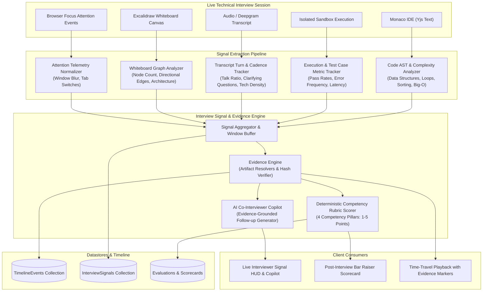

# Strict Implementation Plan: Real-Time Interview Signal & Evidence Engine

## 0. Mission and Non-Negotiable Rules

Build a production-grade **Interview Signal & Evidence Engine** for the Jobly platform. The engine continuously aggregates, analyzes, and synthesizes multi-modal real-time streams (Code edits & AST, Execution outputs, Audio & Transcript turns, Whiteboard vector graphs, and Attention signals) into deterministic, evidence-grounded candidate evaluations and live interviewer guidance.

Every assessment, score, and recommendation must be cryptographically and chronologically linked to verified interview artifacts (`EvidenceReference`) in the Unified Timeline.

### The Five Deliverables:
1. **Multi-Modal Signal Extractor**: Continuous extraction of signals across Coding (AST heuristics, time/space complexity, test iterations), Communication (speaker turns, talk-to-listen ratios, technical terminology density), Whiteboard (graph connectivity, architecture patterns), and Browser Attention (non-punitive focus tracking).
2. **Deterministic Evidence Graph (`EvidenceEngine`)**: Polymorphic linking of all competency assessments directly to immutable timeline events (`TRANSCRIPT`, `CODE_CHECKPOINT`, `EXECUTION_RESULT`, `WHITEBOARD_SNAPSHOT`, `TIMELINE_EVENT`).
3. **Bar Raiser Competency Rubric Scorer (`rubricScorer`)**: Mathematical mapping of verified signals to 4 standardized technical competencies (1. Problem Solving & Decomposition, 2. Algorithmic Implementation & Code Quality, 3. System Architecture & Tradeoff Reasoning, 4. Technical Communication & Collaboration) with calibrated 1–5 scoring and confidence metrics.
4. **Real-Time Co-Interviewer Copilot**: Live, grounded question generator that surfaces contextual, evidence-backed inquiry prompts to interviewers based on active code AST patterns and recent signals.
5. **Canonical Contracts & Zero-Trust Schemas**: Strict Zod schemas in `@jobly/contracts` governing all signal payloads, evidence locators, scorecards, and API transport.

---

### Non-Negotiable Guardrails

- **Zero-Hallucination Evidence Grounding**: The AI Copilot and evaluation engine must NEVER cite a data structure, algorithm, or statement that is not verifiably present in the candidate's code AST or transcript.
- **Strict Non-Discrimination**: Protected attributes (race, gender, accent, age, disability, background noise) are strictly excluded from signal analysis and competency scoring.
- **Non-Punitive Attention Tracking**: Browser focus signals (tab hidden, window blur) are recorded strictly as telemetry signals for interviewer awareness and never as automated proof of cheating or automatic rejection.
- **Immutable Timeline Verification**: An evaluation cannot reference a deleted or non-existent timeline artifact (`offsetMs` must be bounded to `actualStart` and `actualEnd`).
- **Deterministic Versioning**: All signal extractions and evaluations must store `engineVersion: "signals-engine/2026-08-v1"` and ruleset hashes.

---

## 1. Architectural Blueprint & Data Flow



---

## 2. Canonical Contracts (`packages/contracts/src/signals.ts`)

Define strict Zod schemas for all signal types, evidence references, and competency scorecards:

```typescript
export const SIGNAL_ENGINE_VERSION = "signals-engine/2026-08-v1" as const;

export const EvidenceTypeSchema = z.enum([
  "TRANSCRIPT",
  "CODE_CHECKPOINT",
  "EXECUTION_RESULT",
  "WHITEBOARD_SNAPSHOT",
  "TIMELINE_EVENT",
]);

export const EvidenceReferenceSchema = z.object({
  id: z.string().min(1),
  type: EvidenceTypeSchema,
  timelineEventId: z.string().min(1),
  offsetMs: z.number().int().nonnegative(),
  locator: z.object({
    file: z.string().optional(),
    startLine: z.number().int().positive().optional(),
    endLine: z.number().int().positive().optional(),
    quote: z.string().max(500).optional(),
    speaker: z.string().optional(),
    snapshotVersion: z.number().int().optional(),
  }).strict(),
  summary: z.string().min(1).max(300),
  verificationHash: z.string().min(8),
}).strict();

export const CompetencyPillarSchema = z.enum([
  "problem_solving",
  "coding_algorithms",
  "system_design",
  "communication",
]);

export const CompetencyRatingSchema = z.object({
  pillar: CompetencyPillarSchema,
  score: z.number().min(1).max(5), // 1: Unsatisfactory, 2: Needs Growth, 3: Competent, 4: Strong, 5: Exceptional
  confidence: z.number().min(0).max(1),
  rationale: z.string().min(1).max(1000),
  evidenceReferences: z.array(EvidenceReferenceSchema).min(1),
  signalsObserved: z.array(z.string()).default([]),
}).strict();

export const HiringDecisionSchema = z.enum([
  "STRONG_HIRE",
  "HIRE",
  "LEAN_HIRE",
  "LEAN_REJECT",
  "REJECT",
]);

export const InterviewSignalSchema = z.object({
  id: z.string().min(1),
  sessionId: z.string().min(1),
  category: z.enum(["coding", "communication", "whiteboard", "attention", "execution"]),
  name: z.string().min(1),
  indicator: z.enum(["positive", "neutral", "concern"]),
  weight: z.number().min(0.1).max(5.0).default(1.0),
  offsetMs: z.number().int().nonnegative(),
  payload: z.record(z.any()),
  evidenceRef: EvidenceReferenceSchema.optional(),
  createdAt: z.string().datetime(),
}).strict();
```

---

## 3. Step-by-Step Implementation Phases

### Phase 1: Canonical Contract & Types Definition (`packages/contracts`)
- [ ] Create `packages/contracts/src/signals.ts` with strict Zod schemas for all signal types, evidence references, competency ratings, and scorecards.
- [ ] Export schemas and TypeScript types in `packages/contracts/src/index.ts`.
- [ ] Rebuild `packages/contracts` and verify clean type compilation across `jobly-api` and `jobly-web`.

### Phase 2: Core Signal Extractor & AST Analyzer (`jobly-api/src/modules/signals`)
- [ ] Implement `signalExtractor.js`:
  - Code AST pattern matching for algorithmic constructs (traversals, dynamic programming, sorting, recursion, data structures).
  - Code complexity heuristics (cyclomatic complexity, nesting depth, estimated Big-O).
  - Execution result analyzer (syntax vs runtime errors, test pass ratios, duration metrics).
  - Transcript speech cadence analyzer (turn durations, talk-time ratio, clarification markers).
  - Whiteboard graph analyzer (structural node count, connections).
  - Attention telemetry signal normalizer.

### Phase 3: Evidence Engine & Timeline Linking (`jobly-api/src/modules/signals/evidenceEngine.js`)
- [ ] Implement `evidenceEngine.js`:
  - `createEvidenceReference`: Builds validated `EvidenceReference` linked to timeline events, code checkpoints, or whiteboard snapshots.
  - `verifyEvidenceReference`: Validates that referenced timeline events exist in MongoDB and match the session timestamp range.
  - `resolveEvidenceArtifact`: Resolves line ranges in code checkpoints and quotes in transcripts for interactive UI navigation.

### Phase 4: Deterministic Rubric Scorer & AI Copilot (`jobly-api/src/modules/signals/rubricScorer.js`)
- [ ] Implement `rubricScorer.js`:
  - Deterministic evaluation computing 1–5 scores for the 4 core competencies based on grounded evidence.
  - Mathematical confidence scoring based on evidence depth.
  - Exclusions enforcement (stripping protected data).
- [ ] Update `jobly-api/src/modules/ai/interviewAssistant.js`:
  - Ground follow-up questions in verifiable AST patterns.
  - Generate full Bar Raiser scorecard with linked evidence citations.

### Phase 5: Database Models & REST API Endpoints
- [ ] Create `InterviewSignal.js` Mongoose model.
- [ ] Update `Evaluation.js` and `InterviewScorecard.js` with strict Zod schema validation and evidence references.
- [ ] Create `signals.controller.js` and `signals.routes.js`:
  - `POST /api/signals/extract`: Extract signals from active workspace state.
  - `GET /api/signals/session/:sessionId`: Retrieve timeline signals for session.
  - `POST /api/evaluations/:sessionId/competencies`: Submit rubric score with evidence.
  - `GET /api/evaluations/:sessionId/evidence/:evidenceId`: Fetch resolved evidence details.
- [ ] Mount routes in `jobly-api/src/app.js`.

### Phase 6: Real-Time WebSocket Signal Coordination
- [ ] Update `jobly-api/src/infrastructure/realtime/socketio.js`:
  - Real-time signal broadcast events (`interview_signal_emitted`, `evidence_created`).
  - Rate limiting & debouncing on signal emissions to avoid socket congestion.

### Phase 7: Frontend Studio Integration (`jobly-web`)
- [ ] Create `SignalHUD.tsx` in `jobly-web/src/components/interview/ai/SignalHUD.tsx` displaying live technical observations and copilot suggestions.
- [ ] Update `_app.interview.$roomKey.feedback.tsx` with interactive 4-pillar competency scoring and clickable timeline evidence links.
- [ ] Update `_app.interview.$roomKey.replay.tsx` with signal and evidence markers on the timeline scrubber.

### Phase 8: Testing, Verification & Chaos Hardening
- [ ] Unit tests for `signalExtractor`, `evidenceEngine`, and `rubricScorer`.
- [ ] Integration tests for signal endpoints and evidence-backed evaluation submissions.
- [ ] Chaos tests for broken evidence references and adversarial AST payloads.
- [ ] Run full test suite (`npm test`) to guarantee zero regressions across all 36+ suites.

---

## 4. Verification & Testing Matrix

| Test Suite | File | Focus Areas |
| :--- | :--- | :--- |
| **Unit: Signal Extractor** | `tests/unit/signalExtractor.test.js` | AST regex matching, complexity calculation, execution metrics, talk-time ratio |
| **Unit: Evidence Engine** | `tests/unit/evidenceEngine.test.js` | Evidence creation, hash verification, broken reference validation |
| **Unit: Rubric Scorer** | `tests/unit/rubricScorer.test.js` | 1–5 scoring math, 4 competency pillars, confidence computation |
| **Integration: Signals API** | `tests/integration/signalsApi.test.js` | Signal extraction routes, session querying, RBAC guards |
| **Integration: Evidence Evaluation** | `tests/integration/evidenceEvaluation.test.js` | Competency submission, timeline event verification |
| **Chaos: Adversarial Signals** | `tests/chaos/signals-adversarial.test.js` | Fuzzed AST inputs, out-of-bounds timestamps, spoofed evidence |
