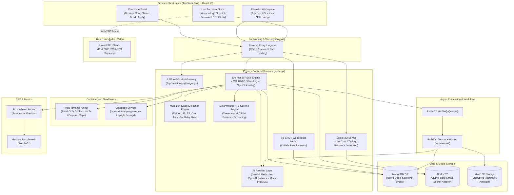
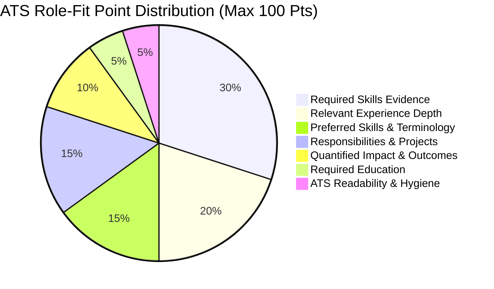

<p align="center">
  
</p>

<p align="center">
  
</p>

<p align="center">
  <a href="#"></a>
  <a href="#"></a>
  <a href="#"></a>
  <a href="#"></a>
  <a href="#"></a>
  <a href="#"></a>
  <a href="#"></a>
  <a href="#"></a>
</p>

---

## 📑 Table of Contents

- [🌟 Executive Overview](#-executive-overview)
- [🏛️ System Architecture \& Data Flow](#️-system-architecture--data-flow)
- [📦 Monorepo Workspace Structure](#-monorepo-workspace-structure)
- [🔬 Core Subsystems \& Technical Deep Dive](#-core-subsystems--technical-deep-dive)
  - [1. AI-Powered Resume Ingestion \& Extraction](#1-ai-powered-resume-ingestion--extraction)
  - [2. Deterministic ATS Role-Fit Engine (`ats-analysis/2026-08-v1`)](#2-deterministic-ats-role-fit-engine-ats-analysis2026-08-v1)
  - [3. Intelligent Job Marketplace \& Prompt Builder](#3-intelligent-job-marketplace--prompt-builder)
  - [4. Candidate Pipeline, State Machine \& Real-Time Messaging](#4-candidate-pipeline-state-machine--real-time-messaging)
  - [5. Live Collaborative Technical Interview Suite](#5-live-collaborative-technical-interview-suite)
    - [A. Monaco Code Editor + Yjs CRDT Synchronization](#a-monaco-code-editor--yjs-crdt-synchronization)
    - [B. Multi-Language Execution Sandbox \& Automated Test Runner](#b-multi-language-execution-sandbox--automated-test-runner)
    - [C. Containerized Interactive PTY Terminal Streaming](#c-containerized-interactive-pty-terminal-streaming)
    - [D. LiveKit WebRTC Video/Audio Conferencing](#d-livekit-webrtc-videoaudio-conferencing)
    - [E. Collaborative Excalidraw Whiteboard Canvas](#e-collaborative-excalidraw-whiteboard-canvas)
    - [F. Language Server Protocol (LSP) Gateway](#f-language-server-protocol-lsp-gateway)
    - [G. AI Co-Interviewer Copilot \& Post-Interview Evaluation](#g-ai-co-interviewer-copilot--post-interview-evaluation)
    - [H. Session Timeline \& Time-Travel Replay Scrubber](#h-session-timeline--time-travel-replay-scrubber)
  - [6. High-Performance Modern Frontend (`jobly-web`)](#6-high-performance-modern-frontend-jobly-web)
  - [7. Shared Monorepo Contracts (`packages/contracts`)](#7-shared-monorepo-contracts-packagescontracts)
  - [8. Infrastructure, Kubernetes Autoscaling \& SRE Observability](#8-infrastructure-kubernetes-autoscaling--sre-observability)
- [📡 Comprehensive API \& WebSocket Reference](#-comprehensive-api--websocket-reference)
  - [REST API Endpoints](#rest-api-endpoints)
  - [Real-Time WebSocket Protocol Matrix](#real-time-websocket-protocol-matrix)
- [🗄️ Database Schemas \& Data Models](#️-database-schemas--data-models)
- [🚀 Quick Start \& Local Development](#-quick-start--local-development)
  - [Prerequisites](#prerequisites)
  - [Environment Configuration](#environment-configuration)
  - [Bootstrapping with Docker Compose](#bootstrapping-with-docker-compose)
  - [Running the Frontend](#running-the-frontend)
  - [Database Seeding](#database-seeding)
- [🧪 Testing \& Quality Assurance](#-testing--quality-assurance)
  - [Backend Test Suite (Jest)](#backend-test-suite-jest)
  - [Frontend Unit Tests (Vitest)](#frontend-unit-tests-vitest)
  - [End-to-End Tests (Playwright)](#end-to-end-tests-playwright)
  - [Load \& Chaos Engineering (k6)](#load--chaos-engineering-k6)
- [🔒 Security, Rate Limiting \& Production Hardening](#-security-rate-limiting--production-hardening)
- [🤝 Contributing](#-contributing)
- [📜 License](#-license)

---

## 🌟 Executive Overview

**Jobly** is a production-grade, full-stack recruitment, evaluation, and live technical interviewing platform. Designed to eliminate the inefficiencies of legacy recruiting workflows and opaque applicant tracking systems, Jobly pairs **Google Gemini LLM intelligence** with **deterministic, mathematically verifiable ATS scoring** and a **zero-latency, collaborative technical interview suite**.

### Why Jobly?

| Capability | Legacy Recruitment Platforms | Jobly Platform |
| :--- | :--- | :--- |
| **Resume Parsing** | Brittle regex / basic keyword counters | **Gemini Flash Lite LLM** structured extraction + MinIO object persistence + fallback heuristics |
| **ATS Scoring** | Opaque black-box keyword density scores | **Deterministic 7-category point system (0-100)** with grounded quote citations & bias exclusions |
| **Job Creation** | Manual copywriting & manual tagging | **AI Natural Language Job Generator** with automatic skill classification & weighting |
| **Interviews** | Third-party meeting links + disconnected editors | **Integrated live interview suite**: Monaco Editor + Yjs CRDT + LiveKit WebRTC + Excalidraw + Terminal |
| **Code Execution** | Unsafe host evaluation or external embeds | **Isolated Docker & Process Sandboxes** supporting 8 languages with memory & time caps |
| **Post-Interview** | Fragmented interviewer notes | **AI Co-Interviewer Copilot + Bar Raiser Scorecard** backed by timestamped timeline evidence |

---

## 🏛️ System Architecture & Data Flow

Jobly is orchestrated as a distributed microservice topology backed by high-throughput messaging, streaming protocols, and persistent datastores:



---

## 📦 Monorepo Workspace Structure

```
Resume_Parser/
├── jobly-api/                     # Primary Express.js REST API & Real-Time Server
│   ├── src/
│   │   ├── app.js                 # Middleware pipeline, security headers, route mounting
│   │   ├── server.js              # HTTP server, WebSocket upgrades (Yjs, LSP, Socket.IO)
│   │   ├── config/                # Database (MongoDB), Redis, Pino Logger, Environment config
│   │   ├── controllers/           # HTTP Request Handlers (Auth, ATS, Interview, Coding, Jobs, etc.)
│   │   ├── infrastructure/        # Deep Infrastructure Layer
│   │   │   ├── cache/             # Redis caching service
│   │   │   ├── events/            # Domain events & SSE manager
│   │   │   ├── lsp/               # WebSocket Language Server Protocol Gateway (Pyright, TS, Clangd)
│   │   │   ├── observability/     # Prometheus metrics collection
│   │   │   ├── queue/             # BullMQ Redis queue manager
│   │   │   ├── realtime/          # Socket.IO handlers, Yjs CRDT coordinator & WebSocket server
│   │   │   ├── sandbox/           # Secure multi-language execution sandbox & test runner
│   │   │   ├── telemetry/         # OpenTelemetry tracing & request duration middleware
│   │   │   ├── temporal/          # Temporal workflows & activities
│   │   │   ├── terminal/          # Pseudo-terminal streaming service (local PTY / remote container)
│   │   │   └── webrtc/            # LiveKit room management & token minting
│   │   ├── middleware/            # JWT RBAC, Multer file upload, Rate limiters, Request IDs
│   │   ├── models/                # 15 Mongoose Schemas (User, Job, InterviewSession, AtsAnalysis, etc.)
│   │   ├── modules/
│   │   │   ├── ai/                # AI Provider Factory (Gemini, OpenAI, Mock) & Interview Copilot
│   │   │   └── ats/               # Deterministic ATS Scoring, Taxonomy normalization, Evidence builder
│   │   ├── routes/                # 16 Express route modules
│   │   ├── services/              # AI Service, Transcription, Interview Membership & Config Parsers
│   │   ├── utils/                 # Job matching algorithms & text sanitizers
│   │   └── workers/               # Async Resume BullMQ/Temporal Processor entrypoints
│   ├── terminal-runner/           # Standalone isolated Docker container for interactive terminal execution
│   │   ├── Dockerfile             # Hardened Alpine image with dropped capabilities
│   │   └── server.js              # Ephemeral PTY process manager (Port 4100)
│   ├── tests/                     # 36 Jest Test Suites (Unit, Integration, Chaos & Security)
│   ├── Dockerfile                 # Multi-stage production container for API
│   ├── Dockerfile.worker          # Background worker container
│   └── package.json
│
├── jobly-web/                     # Frontend Application (TanStack Start + React 19 + TypeScript)
│   ├── src/
│   │   ├── routes/                # TanStack File-Based Routes (SSR enabled)
│   │   │   ├── index.tsx          # High-impact landing page with 3D R3F visuals
│   │   │   ├── auth.tsx           # Unified Seeker / Recruiter Auth portal
│   │   │   ├── _app.dashboard.tsx # Role-specific metrics & analytics overview
│   │   │   ├── _app.resume.tsx    # PDF Drag-and-drop, ATS Scanner & Health Radar
│   │   │   ├── _app.jobs.tsx      # Job marketplace with semantic search & ATS matching
│   │   │   ├── _app.post-job.tsx  # AI Job Post Creator with Gemini prompt assistant
│   │   │   ├── _app.applicants.tsx# Recruiter candidate review & pipeline kanban
│   │   │   ├── _app.applications.tsx # Candidate application tracker & live chat
│   │   │   ├── _app.interviews.tsx# Interview manager & schedule portal
│   │   │   ├── _app.interview.$roomKey.tsx           # Collaborative Live Technical Interview Studio
│   │   │   ├── _app.interview.$roomKey.feedback.tsx  # Multi-criteria evaluation scorecard
│   │   │   └── _app.interview.$roomKey.replay.tsx    # Time-travel session replay scrubber
│   │   ├── components/
│   │   │   ├── interview/         # Monaco IDE, LiveKit Media grid, Terminal, Excalidraw, AI Copilot
│   │   │   ├── dashboard/         # ATS score rings, match breakdowns, metric cards
│   │   │   ├── fx/ & cursor/      # Visual effects, 3D Canvas, particle systems, Hero Orb
│   │   │   └── ui/                # 35+ shadcn/ui & Radix UI accessible primitives
│   │   ├── hooks/                 # Custom React hooks (LiveKit, Yjs, Terminal, Auth)
│   │   └── lib/                   # API client, WebSocket helpers, TanStack query clients
│   ├── e2e/                       # Playwright End-to-End Test Specs
│   ├── tests/                     # Vitest Unit & Component Tests
│   └── package.json
│
├── packages/
│   └── contracts/                 # Shared Monorepo Contracts & Strict Zod Schemas
│       ├── src/
│       │   ├── ats.ts             # AtsAnalysis, Categories, Evidence & Gaps schemas
│       │   ├── resume.ts          # ResumeProfile, Experience, Education & Skill schemas
│       │   ├── job.ts             # JobAtsProfile, Requirements & Criteria schemas
│       │   ├── upload.ts          # File upload & ingestion payload schemas
│       │   └── theme.ts           # Design tokens & color schemas
│       └── package.json
│
├── k8s/                           # Production Kubernetes Manifests
│   └── deployment.yaml            # Deployments, Services, and KEDA Redis queue autoscaler
├── k6/                            # Performance & Chaos Stress Tests
│   ├── load-test.js               # HTTP endpoint load generator
│   ├── chaos-network-degradation.js # WebSocket & API packet loss simulation
│   └── webrtc-livekit-signaling-load.js # WebRTC signaling stress test
├── docker-compose.yml             # Complete 8-service local production orchestration
├── prometheus.yml                 # Prometheus scrape configuration
└── package.json                   # Root monorepo orchestration scripts
```

---

## 🔬 Core Subsystems & Technical Deep Dive

### 1. AI-Powered Resume Ingestion & Extraction

```
[Candidate PDF Upload] ──> [Multer Validation (10MB, PDF only)] ──> [MinIO S3 Bucket]
                                        │
                                        ▼
                             [BullMQ Redis Queue]
                                        │
                                        ▼
                         [jobly-worker Background Job]
                                        │
                ┌───────────────────────┴───────────────────────┐
                ▼                                               ▼
     [pdf-parse Text Extraction]                   [Gemini Flash Lite Structured Prompt]
                │                                               │
                └───────────────────────┬───────────────────────┘
                                        ▼
                           [Schema Validation via Zod]
                                        │
                                        ▼
                       [MongoDB: ResumeUpload & AtsAnalysis]
```

- **Binary Handling**: Resumes are streamed into **MinIO S3** (`jobly-resumes` bucket) with SHA-256 content addressing.
- **LLM Pipeline**: Text extracted via `pdf-parse` is passed to **Google Gemini Flash Lite** via `@google/genai` with strict JSON schema instructions to output a normalized `ResumeProfile` (skills, experience, bullets, education, certifications, and detected sections).
- **Fault-Tolerant Cascade**: If the LLM call encounters rate limits, the system triggers a **circuit breaker** (`opossum`) and utilizes deterministic regex heuristics to parse contact info, sections, and canonical skills without failing the user upload.

---

### 2. Deterministic ATS Role-Fit Engine (`ats-analysis/2026-08-v1`)

Unlike conventional ATS systems that rely on naive keyword counting or non-deterministic LLM score guessing, Jobly uses a **strictly deterministic, mathematical scoring engine** where points are mathematically bounded to **0–100**.



#### Category Scoring Breakdown

1. **Required Skills Evidence (Max 30 pts)**:
   - Evaluated against `jobAtsProfile.mustHaveSkills`.
   - Each skill is resolved to a canonical ID via `skills.v1.json` taxonomy.
   - Points awarded only if corroborated by verified quotes in the candidate's resume or experience bullets.
   - *Redistribution Logic*: If a job defines no must-have skills, the 30 points are redistributed equally (+15 to Preferred Skills, +15 to Responsibilities).
2. **Preferred Skills & Terminology (Max 15 pts + redistribution)**:
   - Evaluated against `jobAtsProfile.preferredSkills`.
3. **Relevant Experience & Seniority Depth (Max 20 pts)**:
   - Measures candidate total experience years against `minimumExperienceYears` (up to 12 pts).
   - Target title matching against historical positions (up to 8 pts).
4. **Responsibilities & Project Evidence (Max 15 pts + redistribution)**:
   - Semantic phrase matching against candidate bullet points.
5. **Quantified Impact & Outcomes (Max 10 pts)**:
   - Regex-based detection of metrics, percentages, currency, and numerical outcomes (`/\b(?:\d+[\d,.]*|\d+k|\d+m|\d+x|\d+%\b|\$\d+)/i`).
6. **Required Education & Certifications (Max 5 pts)**:
   - Degree level and qualification validation.
7. **ATS Readability & Hygiene (Max 5 pts)**:
   - Validates document section structure and presence of essential contact channels.

#### Bias Elimination & Non-Discrimination
Jobly enforces an **explicit exclusions policy**:
- **Protected Characteristics**: Race, gender, age, religion, marital status, and disability are stripped and excluded from scoring computations.
- **Institution Tiering**: Candidates are not penalized or boosted based on university brand or prestige.

---

### 3. Intelligent Job Marketplace & Prompt Builder

- **AI Job Description Generator**: Recruiters input natural language prompts (e.g. *"Senior Backend Engineer with Go, Kafka, and Kubernetes experience"*). The Gemini engine expands this into:
  - Role overview and core responsibilities.
  - Weighted `mustHaveSkills` vs `preferredSkills`.
  - Minimum experience years and target title aliases.
  - Salary range and location requirements.
- **Candidate Job Matching Feed**: Candidates receive real-time match calculations on the `/api/jobs/match` feed, complete with compatibility score badges and missing skill gap previews.

---

### 4. Candidate Pipeline, State Machine & Real-Time Messaging

```
[Candidate Applies] ──> [APPLIED] ──> [REVIEWING] ──> [SHORTLISTED] ──> [INTERVIEW_SCHEDULED] ──> [OFFERED]
                                 │            │                    │
                                 └──> [REJECTED] ──────────────────┘
```

- **Role-Based Workflows**: Recruiters manage candidates across pipeline stages with instant status transition webhooks.
- **Socket.IO Real-Time Chat**: Candidates and recruiters communicate in dedicated application message threads.
- **Clustered Socket Architecture**: Backed by `@socket.io/redis-adapter`, allowing horizontal multi-node scaling with ephemeral typing indicators and presence tracking.

---

### 5. Live Collaborative Technical Interview Suite

The crown jewel of Jobly is the **Live Collaborative Technical Interview Studio** (`/interview/:roomKey`), combining 8 synchronous subsystems in a unified, multi-pane browser interface:

```
┌───────────────────────────────────────────────────────────────────────────┐
│                          JOBLY LIVE INTERVIEW SUITE                       │
├──────────────────────────┬──────────────────────────┬─────────────────────┤
│   MONACO CODE EDITOR     │  EXCALIDRAW WHITEBOARD   │  LIVEKIT WEBRTC     │
│  - Yjs CRDT Sync         │  - Real-time vector draw │  - HD Video/Audio   │
│  - Multi-file tree       │  - Architecture diagrams │  - Screen Sharing   │
│  - LSP Code Intelligence │  - Snapshot persistence  │  - Active Speaker   │
├──────────────────────────┴──────────────────────────┼─────────────────────┤
│   INTERACTIVE TERMINAL / CODE RUNNER                │  AI COPILOT & NOTES │
│  - Multi-language sandbox execution (8 languages)   │  - Follow-up Qs     │
│  - Streaming xterm.js containerized PTY             │  - Code analysis    │
│  - Automated unit test validation                   │  - Scorecard rubric │
└─────────────────────────────────────────────────────┴─────────────────────┘
```

#### A. Monaco Code Editor + Yjs CRDT Synchronization
- **Conflict-Free Replicated Data Types (CRDT)**: Built on `yjs` and `y-protocols`, document edits from multiple peers are synced using binary diffs (`MESSAGE_SYNC` & `MESSAGE_AWARENESS`).
- **Presence & Cursors**: Live remote cursors, selections, and user color tags render in real time.
- **Debounced MongoDB Persistence**: Documents are debounced (3s) and committed to MongoDB binary fields, preventing data loss on unexpected disconnections.

#### B. Multi-Language Execution Sandbox & Automated Test Runner
Code written during interviews can be executed immediately inside a hardened runtime sandbox supporting 8 languages:

| Language | Extension | Compiler / Engine | Timeout | Memory Limit |
| :--- | :--- | :--- | :--- | :--- |
| **Python** | `.py` | `python3` | 8,000 ms | 256 MB |
| **JavaScript** | `.js` | `node` | 8,000 ms | 256 MB |
| **TypeScript** | `.ts` | `tsx` | 10,000 ms | 256 MB |
| **C++** | `.cpp` | `g++ -O2 -std=gnu++20` | 8,000 ms | 256 MB |
| **Java** | `.java` | `javac` & `java` | 10,000 ms | 512 MB |
| **Go** | `.go` | `go run` | 12,000 ms | 512 MB |
| **Ruby** | `.rb` | `ruby` | 8,000 ms | 256 MB |
| **Rust** | `.rs` | `rustc -O` | 12,000 ms | 512 MB |

- **Security & Buffer Guards**: Maximum standard output is capped at **500 KB** to prevent memory exhaustion attacks (`SIGKILL` enforced).
- **Automated Test Cases**: Supports hidden and visible test cases, validating `stdin` against `expectedOutput` with millisecond duration tracking.

#### C. Containerized Interactive PTY Terminal Streaming
- **Isolated Runner**: In production, interactive shell sessions run inside the `terminal-runner` container—a read-only Alpine image with dropped Linux capabilities (`CAP_DROP ALL`), `no-new-privileges`, and a `128MB tmpfs` workspace.
- **Bidirectional Streaming**: Input and output stream over WebSockets with full `cols`/`rows` terminal resizing support.

#### D. LiveKit WebRTC Video/Audio Conferencing
- **Media Ingress & SFU**: Powered by **LiveKit Server**, providing high-definition video, crystal-clear audio, dynamic simulcast, and screen sharing.
- **Secure Token Minting**: The API issues signed LiveKit access tokens with cryptographic room grants and identity claims.

#### E. Collaborative Excalidraw Whiteboard Canvas
- Candidates and interviewers sketch system architectures, database schemas, and data structures simultaneously on an interactive vector canvas synced via Yjs CRDTs.

#### F. Language Server Protocol (LSP) Gateway
- Jobly proxies **Language Server Protocol (LSP)** JSON-RPC traffic over WebSockets (`/lsp/:sessionKey/:language`).
- Integrates `pyright-langserver`, `typescript-language-server`, and `clangd` directly into the browser's Monaco Editor for autocompletion, hover types, and syntax diagnostics.

#### G. AI Co-Interviewer Copilot & Post-Interview Evaluation
- **Active Follow-Up Generator**: During the live interview, the AI analyzes candidate code AST patterns (e.g. loops, hash maps, sorting) and generates insightful, evidence-grounded follow-up questions for the interviewer.
- **Bar Raiser Scorecard**: Synthesizes the interview timeline, code executions, and transcripts into a structured rubric evaluation (`STRONG_HIRE`, `HIRE`, `LEAN_HIRE`, `LEAN_REJECT`, `REJECT`) with confidence scores and timestamped citations.

#### H. Session Timeline & Time-Travel Replay Scrubber
- Every significant action (code edits, test runs, whiteboard deltas, transcript chunks, browser focus changes) is recorded as a `TimelineEvent`.
- The post-interview replay room (`_app.interview.$roomKey.replay.tsx`) allows interviewers and hiring managers to replay the session step-by-step with synchronized code and video playback.

---

### 6. High-Performance Modern Frontend (`jobly-web`)

- **Modern Stack**: Built with **TanStack Start** (SSR + Vite), **React 19**, and strict **TypeScript**.
- **Visual Design**: Features an immersive **React Three Fiber (R3F)** 3D canvas with interactive particle fields and shaders on the landing page, fluid **Framer Motion** spring transitions, and accessible **shadcn/ui** components.
- **Interactive Analytics**: Utilizes **Recharts** for ATS score rings, radar charts, match distribution breakdowns, and recruiter conversion funnels.

---

### 7. Shared Monorepo Contracts (`packages/contracts`)

Located at `packages/contracts`, this library defines the canonical data models across the entire monorepo using **Zod**:
- `AtsAnalysisSchema` & `AtsCategoryResultSchema`
- `ResumeProfileSchema` & `EvidenceRefSchema`
- `JobAtsProfileSchema` & `JobRequirementSchema`
- `FileUploadResponseSchema`

Guarantees 100% type safety and runtime validation parity between the Node.js API and the React frontend.

---

### 8. Infrastructure, Kubernetes Autoscaling & SRE Observability

- **Prometheus Metrics**: The API exposes Prometheus metrics at `/api/metrics` (request rates, HTTP latencies, sandbox execution times, active WebSocket sessions).
- **Grafana Dashboard**: Pre-configured at port `3001` for real-time observability.
- **OpenTelemetry Tracing**: Distributed tracing with correlation IDs (`x-request-id`) injected into all logs and outgoing requests.
- **Kubernetes Autoscaling (KEDA)**: Configured in `k8s/deployment.yaml` to automatically scale background worker pods from 1 to 10 replicas based on Redis queue depth (`bull:resume-processing:wait`).

---

## 📡 Comprehensive API & WebSocket Reference

### REST API Endpoints

| Method | Route | Description | Auth & Roles |
| :--- | :--- | :--- | :--- |
| `GET` | `/api/health` | Service health, uptime, MongoDB & Redis status | Public |
| `GET` | `/api/metrics` | Prometheus metrics endpoint for scrapers | Public |
| `POST` | `/api/auth/register` | Register new user account (`seeker` or `recruiter`) | Public |
| `POST` | `/api/auth/login` | Authenticate user & receive JWT token | Public |
| `GET` | `/api/users/me` | Fetch authenticated user profile & preferences | 🔒 Any |
| `POST` | `/api/resume/upload` | Upload PDF resume → trigger AI parsing pipeline | 🔒 Seeker |
| `GET` | `/api/resume/me` | Retrieve parsed structured resume profile | 🔒 Seeker |
| `POST` | `/api/jobs` | Create a new job posting | 🔒 Recruiter |
| `POST` | `/api/jobs/ai-generate` | AI prompt expansion into structured job requirements | 🔒 Recruiter |
| `GET` | `/api/jobs` | List published jobs (with search, role, salary filters) | 🔒 Any |
| `GET` | `/api/jobs/match` | ATS-scored job match feed for candidate | 🔒 Seeker |
| `GET` | `/api/jobs/:id` | Get detailed job posting by ID | 🔒 Any |
| `POST` | `/api/applications/:jobId` | Submit job application with ATS match evaluation | 🔒 Seeker |
| `GET` | `/api/applications/me` | Retrieve candidate's active applications | 🔒 Seeker |
| `GET` | `/api/applications/recruiter` | Retrieve recruiter's applicant pipeline | 🔒 Recruiter |
| `PATCH`| `/api/applications/:id/status`| Transition applicant status (`SHORTLISTED`, etc.) | 🔒 Recruiter |
| `POST` | `/api/messages/application/:id`| Send message in application chat thread | 🔒 Any Participant |
| `GET` | `/api/messages/application/:id`| Retrieve message history for application | 🔒 Any Participant |
| `POST` | `/api/interviews/schedule` | Schedule technical interview session & mint room | 🔒 Recruiter |
| `GET` | `/api/interviews/:sessionId` | Fetch interview session metadata & token | 🔒 Participants |
| `POST` | `/api/interviews/:sessionId/token` | Mint signed LiveKit WebRTC access token | 🔒 Participants |
| `POST` | `/api/coding/execute` | Execute code snippet inside isolated sandbox | 🔒 Participants |
| `POST` | `/api/coding/test` | Run automated test suite against candidate code | 🔒 Participants |
| `POST` | `/api/coding/terminal` | Allocate interactive PTY terminal session | 🔒 Participants |
| `POST` | `/api/timeline/event` | Ingest real-time interview timeline event | 🔒 Participants |
| `GET` | `/api/replay/:sessionId` | Retrieve full time-travel playback stream | 🔒 Recruiter |
| `POST` | `/api/evaluations/generate` | Trigger AI Bar Raiser scorecard generation | 🔒 Recruiter |
| `POST` | `/api/evaluations/:sessionId`| Submit final interviewer evaluation & decision | 🔒 Recruiter |
| `POST` | `/api/ats/analyze` | Calculate deterministic ATS role-fit analysis | 🔒 Any |

---

### Real-Time WebSocket Protocol Matrix

```
┌───────────────────────────────┬────────────────────────────────────────────────────────┐
│ Channel / Endpoint            │ Protocol & Payload Responsibilities                    │
├───────────────────────────────┼────────────────────────────────────────────────────────┤
│ Socket.IO (/socket.io/)       │ - join_conversation / leave_conversation               │
│                               │ - user_typing / user_stop_typing                       │
│                               │ - join_interview / participant_joined / participant_left│
│                               │ - editor_cursor_move / peer_cursor_update              │
│                               │ - whiteboard_cursor_move / peer_whiteboard_cursor      │
│                               │ - transcript_chunk / live_transcript_received          │
│                               │ - focus_attention_event (browser visibility signal)    │
│                               │ - terminal_input / terminal_resize                     │
├───────────────────────────────┼────────────────────────────────────────────────────────┤
│ Yjs Code Sync (/collab/:room) │ - Yjs binary CRDT sync (MESSAGE_SYNC, MESSAGE_AWARENESS)│
│                               │ - Monaco editor text buffers and multi-file tree state │
├───────────────────────────────┼────────────────────────────────────────────────────────┤
│ Yjs Whiteboard (/whiteboard/) │ - Yjs binary CRDT sync for Excalidraw vector canvas    │
├───────────────────────────────┼────────────────────────────────────────────────────────┤
│ LSP Gateway (/lsp/:room/:lang)│ - Full-duplex JSON-RPC 2.0 Language Server Protocol    │
│                               │ - textDocument/completion, hover, publishDiagnostics   │
├───────────────────────────────┼────────────────────────────────────────────────────────┤
│ LiveKit WebRTC (Port 7880)    │ - WebRTC SDP Signaling, Audio/Video media tracks       │
└───────────────────────────────┴────────────────────────────────────────────────────────┘
```

---

## 🗄️ Database Schemas & Data Models

Jobly maintains 15 structured MongoDB schemas:

```
 User ───────────────────────┬────────► ResumeUpload
   │                         │              │
   ▼                         │              ▼
  Job ────────┐              │         AtsAnalysis
   │          │              │
   ▼          ▼              ▼
 Application ───► InterviewInvite
   │                  │
   ▼                  ▼
 Message       InterviewSession ─────┬───► CodeCheckpoint
                      │              ├───► WhiteboardSnapshot
                      │              ├───► TimelineEvent
                      │              ├───► InterviewProblem
                      │              ├───► InterviewNote
                      ▼              └───► InterviewScorecard
                  Evaluation
```

- **User**: Authentication credentials (bcrypt), role (`seeker` | `recruiter`), profile bio, normalized skills, and contact metadata.
- **ResumeUpload**: Raw resume metadata, MinIO S3 object keys, file size, extraction status, and parsed text.
- **AtsAnalysis**: Complete deterministic ATS result conforming to schema `ats-analysis/2026-08-v1` (overall score, 7 category scorecards, matched requirement quotes, gap items, and improvement suggestions).
- **Job**: Recruiter job specifications, salary ranges, location, target titles, and structured `jobAtsProfile`.
- **Application**: Seeker job application record, status lifecycle, ATS score snapshot, and recruiter notes.
- **Message**: Real-time communication records between candidate and recruiter.
- **InterviewSession**: Real-time interview room state, room keys, scheduled times, actual start/end timestamps, Yjs binary state buffers, active problem pointer, and session status (`PENDING`, `LIVE`, `COMPLETED`, `CANCELLED`).
- **TimelineEvent**: Chronological event stream (`CODE`, `EXECUTION`, `WHITEBOARD`, `TRANSCRIPT`, `SYSTEM`, `NOTE`, `COPILOT`) with millisecond offsets for time-travel playback.
- **CodeCheckpoint**: Periodic snapshots of candidate code across all workspace files.
- **WhiteboardSnapshot**: Periodic vector captures of the Excalidraw collaborative canvas.
- **InterviewProblem**: Algorithmic problem statements, difficulty, sample inputs, starter code, and test cases.
- **InterviewNote**: Private or shared timestamped interviewer notes.
- **InterviewScorecard**: Multi-category scoring rubric filled by interviewers.
- **Evaluation**: AI Bar Raiser synthesized summary and final hiring recommendation.

---

## 🚀 Quick Start & Local Development

### Prerequisites

- **Node.js**: `v20.x` or higher
- **npm** or **bun**: `v10.x`+
- **Docker & Docker Compose**: `v24.x`+
- **Google Gemini API Key**: [Google AI Studio](https://aistudio.google.com/)

---

### Environment Configuration

Create a `.env` file in the project root (or copy from `.env.example`):

```bash
cp .env.example .env
```

```env
# AI Engine
GEMINI_API_KEY=your_google_gemini_api_key_here

# Networking & Ports
PORT=5000
NODE_ENV=development
JWT_SECRET=super_secret_jwt_key_jobly_2026_production

# Datastores (Configured automatically via Docker Compose)
MONGO_URI=mongodb://localhost:27017/jobmatch
REDIS_HOST=localhost
REDIS_PORT=6379

# Object Storage (MinIO)
S3_ENDPOINT=http://localhost:9000
S3_BUCKET=jobly-resumes
S3_ACCESS_KEY_ID=minioadmin
S3_SECRET_ACCESS_KEY=minioadmin

# LiveKit WebRTC
LIVEKIT_PUBLIC_URL=ws://localhost:7880
TERMINAL_RUNNER_URL=http://localhost:4100
```

---

### Bootstrapping with Docker Compose

To launch the full backend ecosystem (API, Terminal Runner, Worker, MongoDB, Redis, MinIO, Prometheus, Grafana, LiveKit):

```bash
# Start all 8 backend containers in the background
npm run docker:up

# View real-time logs across all services
npm run docker:logs
```

| Service | Host Port | Web Interface / Notes |
| :--- | :--- | :--- |
| **jobly-api** | `http://localhost:5000` | REST API, WebSocket Gateway & Metrics (`/api/metrics`) |
| **terminal-runner** | `http://localhost:4100` | Isolated PTY Execution Runner |
| **MongoDB** | `localhost:27017` | Primary Datastore |
| **Redis** | `localhost:6379` | Cache, PubSub & BullMQ Queues |
| **MinIO Console** | `http://localhost:9001` | S3 Storage UI (`minioadmin` / `minioadmin`) |
| **Prometheus** | `http://localhost:9090` | Metrics Scraper & Query Console |
| **Grafana** | `http://localhost:3001` | Observability Dashboards (`admin` / `admin`) |
| **LiveKit SFU** | `localhost:7880` | WebRTC Media & Signaling Server |

---

### Running the Frontend

In a separate terminal window:

```bash
# Install frontend dependencies (if not already installed)
npm --prefix jobly-web install

# Start the TanStack Start development server
npm run dev:web
```

The web application will be accessible at: **`http://localhost:3000`** (or Vite allocated port).

---

### Database Seeding

Populate your database with realistic demo jobs, seeker profiles, resumes, and interview rooms:

```bash
# Seed standard demo data (users, jobs, applications)
node jobly-api/src/seed.js

# Seed active and past live interview rooms
node jobly-api/add_interviews.js
```

**Default Test Credentials:**
- **Job Seeker**: `alex@example.com` / `password123`
- **Recruiter**: `sarah@techcorp.com` / `password123`

---

## 🧪 Testing & Quality Assurance

Jobly maintains comprehensive multi-layer test coverage across backend units, integration endpoints, chaos degradation, frontend components, and Playwright browser E2E specs.

```
┌─────────────────────────────────────────────────────────────────┐
│                      JOBLY TEST PYRAMID                         │
├─────────────────────────────────────────────────────────────────┤
│  [Playwright E2E Tests]       - Auth, Seeker & Recruiter Flows  │
│  [k6 Chaos & Load Tests]      - WebRTC, PTY Stress & Network Loss│
│  [Jest API Integration Tests] - 36 Suites (Auth, Coding, Yjs)   │
│  [Vitest Frontend Unit Tests] - ATS Rings, Auth, API Client     │
│  [Jest Domain Unit Tests]     - Scoring Math, AST Copilot, RBAC │
└─────────────────────────────────────────────────────────────────┘
```

### Backend Test Suite (Jest)

Run all 36 test suites:

```bash
npm --prefix jobly-api test
```

Generate test coverage report:

```bash
npm --prefix jobly-api run test:coverage
```

### Frontend Unit Tests (Vitest)

```bash
npm --prefix jobly-web run test:unit
```

### End-to-End Tests (Playwright)

Execute automated end-to-end browser journeys across candidate and recruiter flows:

```bash
npm --prefix jobly-web run test:e2e
```

### Load & Chaos Engineering (k6)

Simulate high concurrent user loads and degraded network conditions:

```bash
# Run HTTP API load tests
k6 run k6/load-test.js

# Simulate packet loss and network latency on WebSockets
k6 run k6/chaos-network-degradation.js

# Stress test LiveKit WebRTC signaling connections
k6 run k6/webrtc-livekit-signaling-load.js
```

---

## 🔒 Security, Rate Limiting & Production Hardening

Jobly follows defense-in-depth security standards:

1. **Zero-Trust Role-Based Access Control (RBAC)**: All protected routes verify cryptographically signed JWT tokens with strict role authorization (`seeker` vs. `recruiter`).
2. **Execution Sandbox Isolation**:
   - Compilers and interpreters run inside isolated sub-processes or dedicated Docker containers with dropped capabilities (`CAP_DROP ALL`).
   - Hard execution timeouts (8–12 seconds) and output buffer limits (500 KB).
3. **NoSQL Injection & Sanitization**: Inputs are sanitized via `express-mongo-sanitize` to strip `$` and `.` operators from query payloads.
4. **Security Headers**: Configured via `helmet` with custom Content Security Policies and Cross-Origin Resource Policies.
5. **Token-Bucket Rate Limiting**: Managed via `rate-limiter-flexible` and Redis, protecting endpoints against brute force attacks.
6. **LLM Output Sanitization**: AI responses undergo regex cleaning to prevent JSON payload injection or malformed control character execution.

---

## 🤝 Contributing

Contributions, issues, and feature requests are welcome!

1. Fork the repository
2. Create your feature branch (`git checkout -b feature/amazing-feature`)
3. Commit your changes (`git commit -m 'feat: implement awesome feature'`)
4. Push to the branch (`git push origin feature/amazing-feature`)
5. Open a Pull Request

---

## 📜 License

Distributed under the **MIT License**. See `LICENSE` for more information.

---

<p align="center">
  <b>Architected & Built with ❤️ by <a href="https://github.com/tusharsaharan">Tushar Saharan</a></b>
</p>

<p align="center">
  <a href="https://github.com/tusharsaharan"></a>
  <a href="https://linkedin.com/in/tusharsaharan"></a>
</p>

<p align="center">
  
</p>
